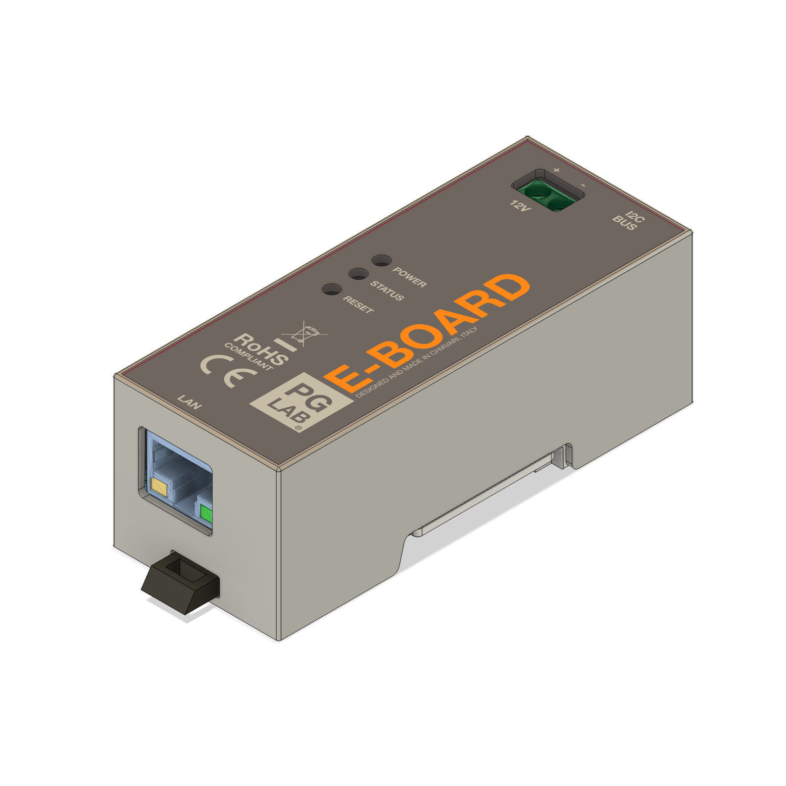
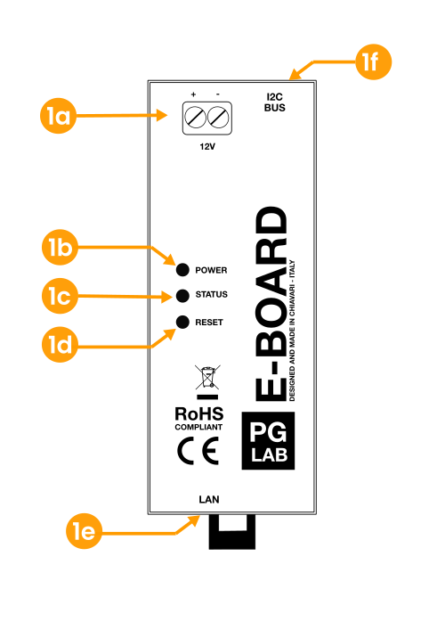
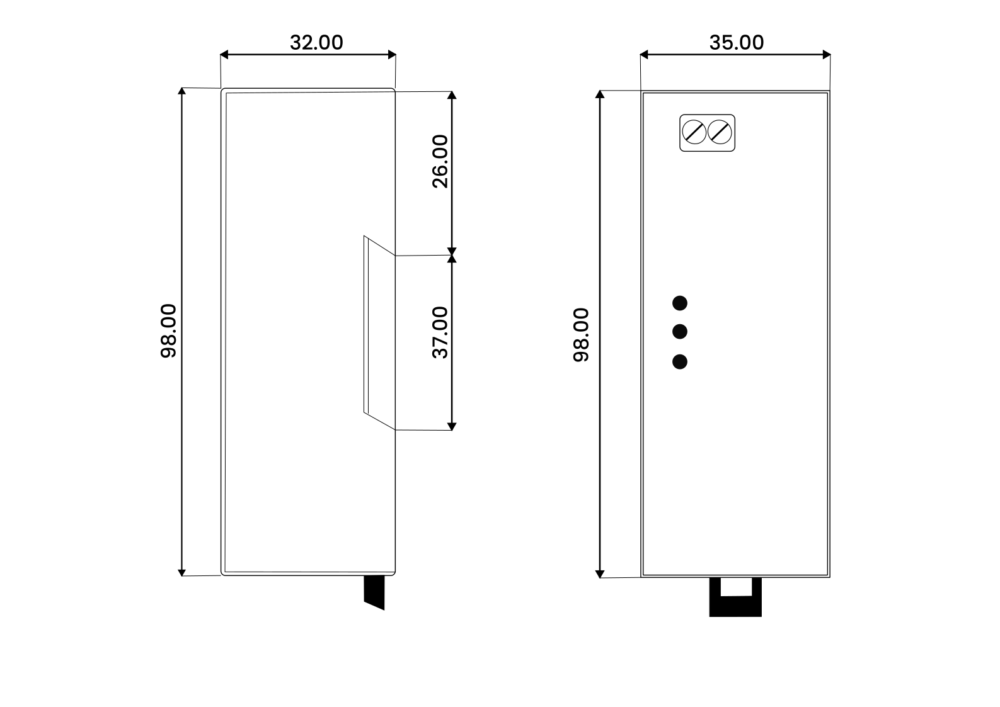
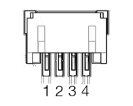
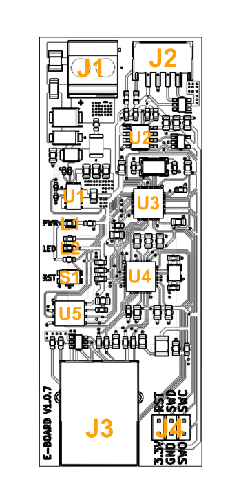
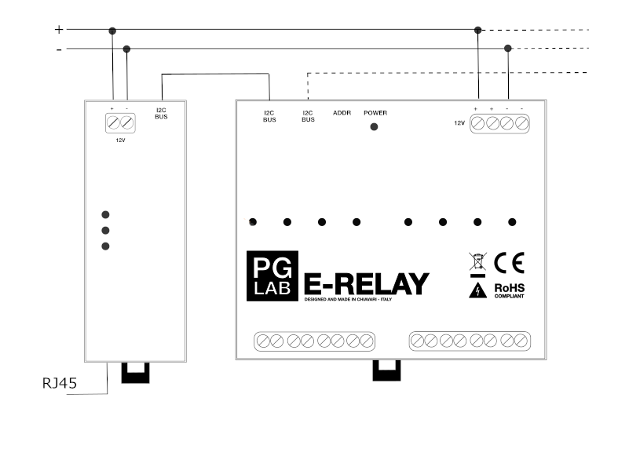

E-BOARD
=======

Description
-----------
The E-BOARD is a microcontroller board with I2C and LAN interfaces. It features
STM32F103 microcontroller running at 72Mhz. E-BOARD has been designed specifically
to use in home automation scenario where a LAN connection is required. E-BOARD uses
an on board MPM3610 step down converted which is able to generate the required 3.3
volts from a range of power options. MPM3610 provides up to 1.2A load current
across the entire input voltage range of 4.7V to 20V. E-BOARD uses the Ethernet chip
controller ENC28J60 to allow a wired Ethernet connection between your E-BOARD and
your local network or Internet. This is particularly useful to reduce electromagnetic noise,
to be faster, stable and more secure. E-BOARD is IEEE 802.3 compatible. E-BOARD uses
24AA02E48 to provide a unique MAC address for the internet connection. 
The firmware can be updated Over the Air (OTA) or reprogramming can be done via the 
6 pins Serial Wire Debug (SWD) port. The SWD port can be used to interactively debug coderunning on E-BOARD.
The E-BOARD is intended to be mounted into a standard switchboard. E-BOARD can
work as a stand-alone device or as an accessory to a home automation controller.

Specification
-------------

The following table shows E-BOARD general specifications.

| **Feature**                    |  **Details**                              |
| :------------------------------|:------------------------------------------|
| Recommended Input Voltage      | 12 VDC                                    |
| Permissible Voltage Range      | 9 - 20 VDC                                |
| MPU                            | ARM Cortex M3, STM32F103TBU6 72Mhz        |
| Flash Memory                   | 8 Mbit                                    |
| Circuit Operating Voltage      | 3.3 V                                     |
| Communication                  | I2C bus extender, RJ45 Ethernet 10 Mbps   |
| Protection                     | ESD, transient on DC input and ports      |
| Protection Rate                | IP20                                      |
| Certifications                 | CE, RoHs                                  |

Mechanical Information
----------------------

| **Installation**          |                                      |
| :-------------------------| :----------------------------------- |
| Mounting Type             | 35 mm DIN rail mountable             |
| Mounting Width            | 2 spacing units wide                 |
| **Supply Voltage**        |                                      |
| Standard Input Voltage    | 12 VDC                               |
| Supply Current Min.       | 7mA                                  |
| Permissible Voltage Range | 9 - 20 VDC                           |
| Protection                | transient protected                  |

Functional Overview
-------------------

*E-BOARD Product View*
 

| **Ref.**     |  **Description**          |
| :------------| :-------------------------|
| 1a           | Power Supply Terminal     |
| 1b           | Power LED                 |
| 1c           | Status LED                |
| 1d           | Reset Button              |
| 1e           | Ethernet Port             |
| 1f           | I2C Port                  |

Mechanical Information
----------------------

*E-BOARD outline (dimensions in mm).*
 
 
| **Description**           |  **Value**                           |
| :-------------------------| :----------------------------------- |
| Mounting Type             | 35 mm DIN Rail Mountable             |
| Mounting Width            | 2 Spacing Units Wide                 |
| Width                     | 35 mm                                |
| Height                    | 98 mm                                |
| Depth                     | 32 mm                                |
| Weight                    | 53.6 gr                              |

Operation Conditions
--------------------

E-BOARD must operate under the following conditions.

| **Description**          | **Min**         | **Max**        |
| :------------------------| :---------------|:---------------|
| Input Voltage            | 9 V             | 20 V           |
| Ambient Temperature      | 0 °C            | 55 °C          |
| Humidity                 | Non-Condensing  | Avoid Icing    |
| Protection Rating        | IP20            |                |

I2C Connector
-------------

*I2C Bus Connector*
 

| **Pin**      |  **Description**         |
| :------------| :------------------------|
| 1            | +3.3 V                   |
| 2            | GROUND                   |
| 3            | SDA                      |
| 4            | SCL                      |

The E-BOARD I2C connector is a 4 pin JST 2.0mm pitch. The I2C connector is used to create the daisy chain from E-BOARD to other devices. 

**Note: The I2C BUS cable must have a maximum length of 30 cm to improve reliability.**

Board Topology
--------------

*E-BOARD Circuit Top View*
 

| **Ref.**     |  **Description**                           |
| :------------| :------------------------------------------|
| J1           | Input Voltage Screw Terminal               |
| J2           | I2C, 4 pin JST                             |
| J3           | RJ45  Connector                            |
| J4           | SWD Pin Header                             |
| L1           | Power Red LED                              |
| L2           | Status Green LED                           |
| S1           | Reset Button                               |
| U1           | Step Down Converter MPM3610GQV             |     
| U2           | I2C I/O Bus Expander PCF8574               |
| U3           | Microcontroller STM32F103TBU6              |
| U4           | Ethernet Controller ENC28J60               |
| U5           | Flash Memory SST25VF080B                   |

Wiring Diagram
--------------

*E-BOARD connected to E-RELAY*
 

Setup and Use
-------------
:warning: **Important** Before beginning the installation, please read carefully and completely the
documentation. Failure to follow recommended procedures could lead to malfunction,
danger to your life or violation of the law. PG LAB Electronics is not responsible for any
loss or damage in case of incorrect installation or operation of this device!

:warning: **Warning** Do not allow children to play with the device. Keep the device away from
children.

:warning: **Warning** Be sure to use the correct power supply and connect the positive and
negative wires with the correct polarity. Failure to follow the recommendation can seriously
damage the E-BOARD device.

:warning: **Caution** Use the E-BOARD/E-RELAY devices only with appliances which comply with
all applicable regulations. A short circuit in any appliance connected
to the E-BOARD/E-RELAY may damage the device.

:warning: **Caution** Do not connect E-BOARD to appliances exceeding the given maximum load!

:warning: **Caution** Connect the E-BOARD only in the way shown in these instructions. Any other
method could cause damage and/or injury.

:warning: **Important** E-BOARD/E-RELAY is a power device for users who are experienced around, and
knowledgeable about high AC Voltage. There is danger of electrocution. Mounting the E-BOARD/E-RELAY
device to the power grid has to be performed with caution. The mounting/installation
of E-BOARD/E-RELAY should be done by a qualified person (electrician).

:warning: **Important**  Even when the E-BOARD is turned off, it is possible to have high voltage across
the screw terminals. Every change in the connection of the wires connected to the
screw terminals must be done after ensuring all local power is powered off/disconnected.

:warning: **Caution**  Do not install the E-BOARD where it can get wet!

:warning: **Caution**  Do not use the E-BOARD if it has been damaged!

:warning: **Caution**  Do not attempt to service or repair the E-BOARD yourself!

Certification
-------------

PG LAB Electronics declare under sole responsibility that the product above is in conformity with the essential requirements of the following EU Directives and therefore qualify for free movement within markets comprising the European Union (EU) and European Economic Area (EEA).

**Enclosure, conforms to:**

- UL94

**ROHS, conforms to:**

- IEC 62321

**Emission, conforms to:**

- EN 55016-2-3:2017 /A1:2019
- EN 55016-2-1:2014 /A1:2017

**Immunity, conforms to:**

- EN 61000-4-2: 2009
- EN IEC 61000-4-3:2020
- EN 61000-4-3:2006 /A1:2008 /IS1:2009 /A2:2010
- EN 61000-4-4: 2012
- EN 61000-4-5:2014 /A1:2017
- EN 61000-4-6: 2014
- EN 61000-4-8: 2010

