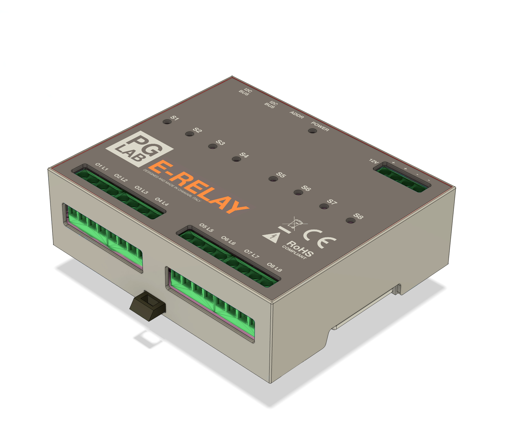
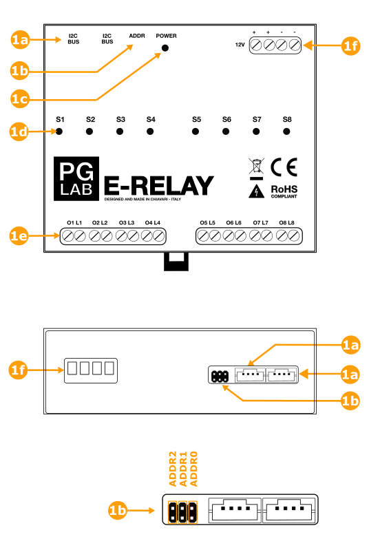
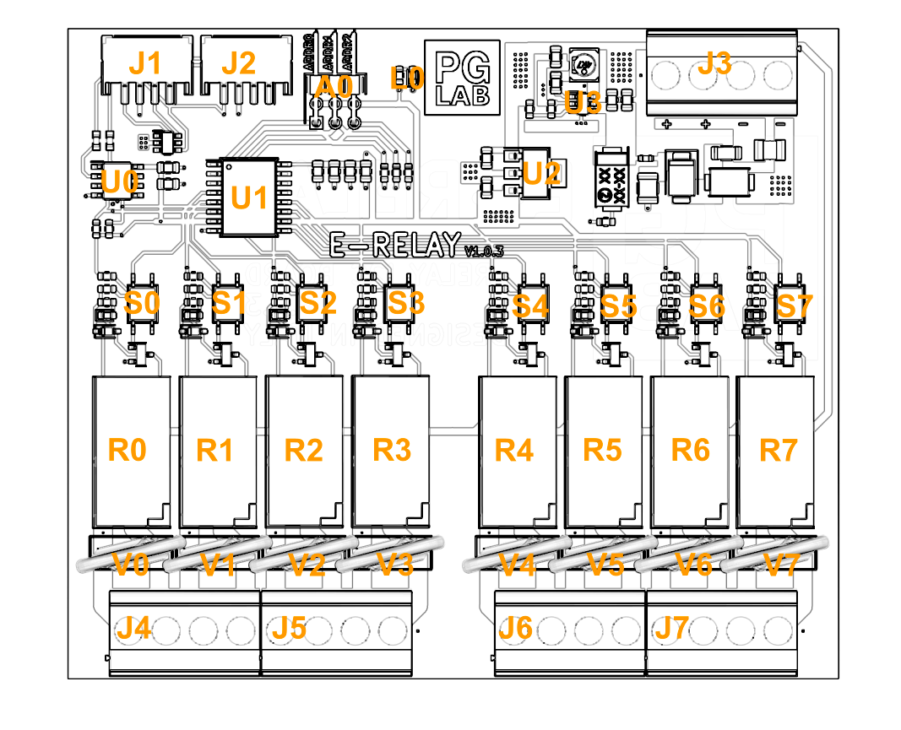
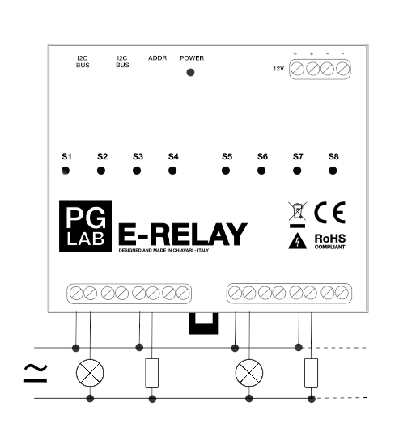

E-RELAY
=======

Description
-----------

The E-RELAY is a power board device that has been designed for switching eight high
powered loads from your E-BOARD. 
The E-RELAY has eight individual Panasonic relays rated up to 5 Amps per channel at 250VAC.
Each channel is optically isolated, has its own LED and screw terminals with NO (Normally Open)
clean contacts. Varistors are present on the screw terminals. This is to protect
E-RELAY circuitry from high voltage spikes when switching inductive loads.
At the heart of the E-RELAY is an PCF8574 that takes I2C commands to toggle the eight
relay outputs. The I2C address of the E-RELAY is configurable by a 3 way Header Pin. This allows
a single E-BOARD to control a daisy chain of up to 8 E-RELAY devices. This means a single E-
BOARD can control up to 64 high voltage loads.

E-RELAY includes safety precautions on the PCB: wide traces
for high amperage and ground isolation between the relay and other circuitry.

E-RELAY is a power device for users who are experienced around, and knowledgeable about high
AC voltage.
The E-RELAY is intended to be mounted into a standard switchboard.
E-BOARD together with E-RELAY are designed to work with your home automation.

Specification
-------------

The following table shows E-RELAY general specifications.

| **Feature**                    |  **Details**                           |
| :------------------------------|:---------------------------------------|
| Recommended Input Voltage      | 12 VDC                                 |
| Permissible Voltage Range      | 9 - 20 VDC                             |
| Outputs                        | 8x Relays, Normally Open (NO) Max 10 A |
| Circuit Operating Voltage      | 3.3/5.0 VDC                            |
| Communication                  | I2C with P82B715DR bus extender        |
| Relay Control                  | with PCF8574 on I2C                    |
| Protection                     | ESD, transient on DC input and ports   |
| Protection Rate                | IP20                                   |
| Certifications                 | CE, RoHs                               |
 

The output terminal contacts of E-RELAY are protected by Varistors to avoid high voltage spikes when switching inductive load. 

!!! Warning
    E-RELAY does not have a terminal output protection from short circuits. An external fuse on the terminal output is needed to prevent damage to E-RELAY from a short circuit load.

Relay Information
----------------------

| **Relays**               |                               |
| :------------------------|:------------------------------|
| N° of Relays             | 8                             |
| Type                     | Normally Open (NO)            |
| ID                       | Panasonic ALQ305              |
| Expected Life            | Min. 10^7 cycles (at 180 times/min.) |
| Switching Voltage AC     | Max 250 VAC                   |
| Switching Voltage DC     | Max 30 VDC                    |
| Switching Current AC     | Max 10 A (125V AC)            |
| Switching Current AC     | Max 5 A  (250V AC)            |
| Switching Current DC     | Max 5 A  (30V DC)             |
| Operate Time (at 20°C)   | 20 mS                         |
| Release Time (at 20°C)   | 20 mS                         |
| Terminal Protection      | With Varistor                 |
| Short Circuit Protection | External fuse required        |

Mechanical Information
----------------------

| **Installation**          |                                      |
| :-------------------------| :----------------------------------- |
| Mounting Type             | 35 mm DIN rail mountable             |
| Mounting Width            | 6 spacing units wide                 |
| **Supply Voltage**        |                                      |
| Standard Input Voltage    | 12 VDC                               |
| Supply Current Min.       | 10mA all relays OFF                  |
| Supply Current Max.       | 200mA all relays ON                  |
| Permissible Voltage Range | 9 - 20 VDC                           |
| Protection                | Transient protected                  |

Functional Overview
-------------------

*E-RELAY Product View*
 

| **Ref**           |  **Description**          |
| :-----------------| :-------------------------|
| 1a                | I2C Bus Ports             |
| 1b                | Address Header Pins       |
| 1c                | Power LED                 |
| 1d                | Relay Status LEDs         |
| 1e                | Output Terminals           |
| 1f                | Power Supply Terminal     |

The Header Pin **1b** is used to set the I2C address for the E-RELAY device. All E-RELAY devices connected to the same I2C daisy chain **must** have a unique I2C address. The following table shows how to place the Jumper Connectors to set the I2C address (*ON - jumper present, OFF - jumper not present*).
 
 
Example: Jumper connector only on ADDR A0 pin set E-RELAY to have a relays index mapping between 8 and 15. 

+-----------------+-----------------+-------------------+
| ADDR            |                 |                   |
+-----+-----+-----+                 |                   |
| A2  | A1  | A0  | I2C   Address   | Relay Mapping     |
+=====+=====+=====+=================+===================+
| OFF | OFF | OFF | 64 (decimal)    | 0-7               |
+-----+-----+-----+-----------------+-------------------+
| OFF | OFF | ON  | 66 (decimal)    | 8-15              |
+-----+-----+-----+-----------------+-------------------+
| OFF | ON  | OFF | 68 (decimal)    | 16-23             |
+-----+-----+-----+-----------------+-------------------+
| OFF | ON  | ON  | 70 (decimal)    | 24-31             |
+-----+-----+-----+-----------------+-------------------+
| ON  | OFF | OFF | 72 (decimal)    | 32-39             |
+-----+-----+-----+-----------------+-------------------+
| ON  | OFF | ON  | 74 (decimal)    | 40-47             |
+-----+-----+-----+-----------------+-------------------+
| ON  | ON  | OFF | 76 (decimal)    | 48-55             |
+-----+-----+-----+-----------------+-------------------+
| ON  | ON  | ON  | 78 (decimal)    | 56-63             |
+-----+-----+-----+-----------------+-------------------+

Mechanical Information
----------------------

*E-RELAY outline (dimensions in mm).*
 
 
| **Description**           |  **Value**                           |
| :-------------------------| :----------------------------------- |
| Mounting Type             | 35 mm DIN Rail Mountable             |
| Mounting Width            | 6 Spacing Units Wide                 |
| Width                     | 105 mm                               |
| Height                    | 98 mm                                |
| Depth                     | 32 mm                                |
| Weight                    | 205.7 gr                             |

Operation Conditions
--------------------

E-RELAY must operate under the following conditions.

| **Description**          | **Min.**        | **Max.**       |
| :------------------------| :---------------|:---------------|
| Input Voltage            | 9 V             | 20 V           |
| Ambient Temperature      | 0 °C            | 55 °C          |
| Humidity                 | Non-Condensing  | Avoid Icing    |
| Protection Rating        | IP20            |                |

I2C Connector
-------------

*I2C Bus Connector*
 

| **Pin**      |  **Description**         |
| :------------| :------------------------|
| 1            | +3.3 V                   |
| 2            | GROUND                   |
| 3            | SDA                      |
| 4            | SCL                      |

E-RELAY has two I2C connectors, both are equivalent. The connector is a 4 pin JST 2.0mm pitch. The I2C connectors are used to create the daisy chain to connect the E-BOARD with different E-RELAY devices. The daisy chain can connect up to 8 E-RELAY's to 1 E-BOARD device. 

**Note: E-RELAY must have a unique I2C address, please set Header Pins.**
 
 
**Note: To improve reliability each I2C BUS cable must have a length of 30 cm max.**

Board Topology
--------------

*E-RELAY Circuit Top View*
 

| **Ref.**     |  **Description**                           |
| :------------| :------------------------------------------|
| J1, J2       | 4 pin JST connector                        |
| J3           | Input Voltage Screw Terminal               |
| J4, J7       | Output Screw Terminal                      |
| A0           | Pin Header for I2C Address                 |
| L0           | Power Red LED                              |
| U0           | I2C Bus Extender                           |     
| U1           | I2C I/O Bus Expander PCF8574               |
| U2           | Linear Voltage Regulator 5V to 3.3V        |
| U3           | Switching Voltage Regulator 12V to 5V      |
| S0, S7       | Ophto-couplers and status led              |
| R0, R7       | Power Relays                               |
| V0, V7       | Varistors                                  |

Wiring Diagram
--------------

*E-RELAY connected with a load*
 

*E-RELAY connected to E-BOARD*
 

Setup and Use
-------------

:warning: **Important** Before beginning the installation, please read carefully and completely the
documentation. Failure to follow recommended procedures could lead to malfunction,
danger to your life or violation of the law. PG LAB Electronics is not responsible for any
loss or damage in case of incorrect installation or operation of this device!

:warning: **Warning** Do not allow children to play with the device. Keep the device away from
children.

:warning: **Warning** Be sure to use the correct power supply and connect the positive and
negative wires with the correct polarity. Failure to follow the recommendation can seriously
damage the E-RELAY device.

:warning: **Caution** Use the E-BOARD/E-RELAY devices only with appliances which comply with
all applicable regulations. A short circuit in any appliance connected
to the E-BOARD/E-RELAY may damage the device.

:warning: **Caution** Do not connect E-BOARD/E-RELAY to appliances exceeding the given maximum load!

:warning: **Caution** Connect the E-RELAY only in the way shown in these instructions. Any other
method could cause damage and/or injury.

:warning: **Important** E-BOARD/E-RELAY is a power device for users who are experienced around, and
knowledgeable about high AC Voltage. There is danger of electrocution. Mounting the E-BOARD/E-RELAY
device to the power grid has to be performed with caution. The mounting/installation
of E-BOARD/E-RELAY should be done by a qualified person (electrician).

:warning: **Important**  Even when the E-BOARD/E-RELAY is turned off, it is possible to have high voltage across
the screw terminals. Every change in the connection of the wires connected to the
screw terminals must be done after ensuring all local power is powered off/disconnected.

:warning: **Caution**  Do not install the E-RELAY where it can get wet!

:warning: **Caution**  Do not use the E-RELAY if it has been damaged!

:warning: **Caution**  Do not attempt to service or repair the E-RELAY yourself!

Certification
-------------

PG LAB Electronics declare under sole responsibility that the product above is in conformity with the essential requirements of the following EU Directives and therefore qualify for free movement within markets comprising the European Union (EU) and European Economic Area (EEA).

**Enclosure, conforms to:**

- UL94

**ROHS, conforms to:**

- IEC 62321

**Emission, conforms to:**

- EN 55016-2-3:2017 /A1:2019
- EN 55016-2-1:2014 /A1:2017

**Immunity, conforms to:**

- EN 61000-4-2: 2009
- EN IEC 61000-4-3:2020
- EN 61000-4-3:2006 /A1:2008 /IS1:2009 /A2:2010
- EN 61000-4-4: 2012
- EN 61000-4-5:2014 /A1:2017
- EN 61000-4-6: 2014
- EN 61000-4-8: 2010

