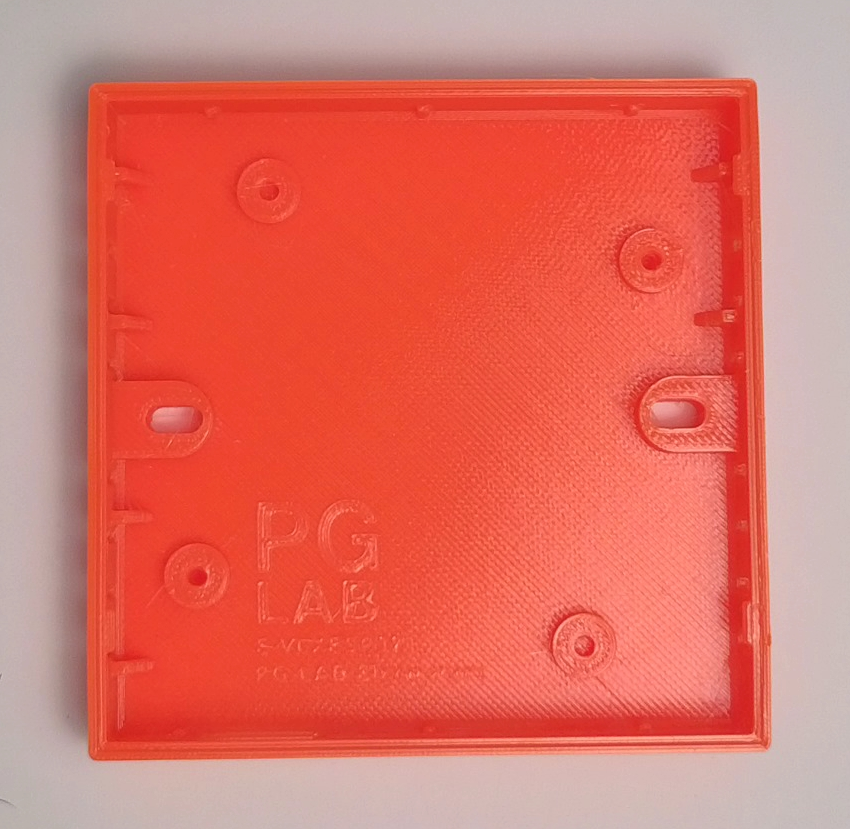
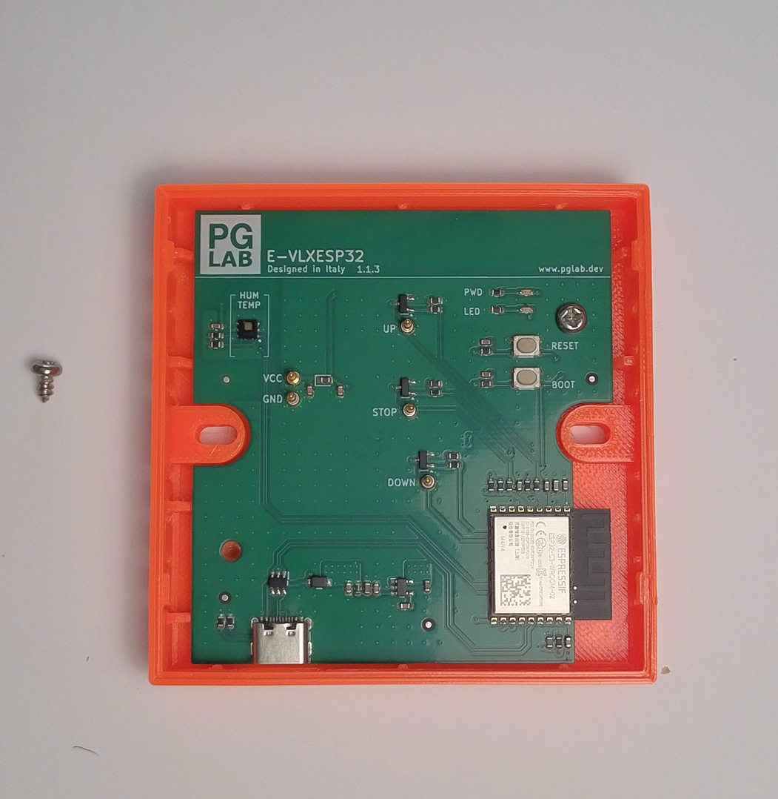
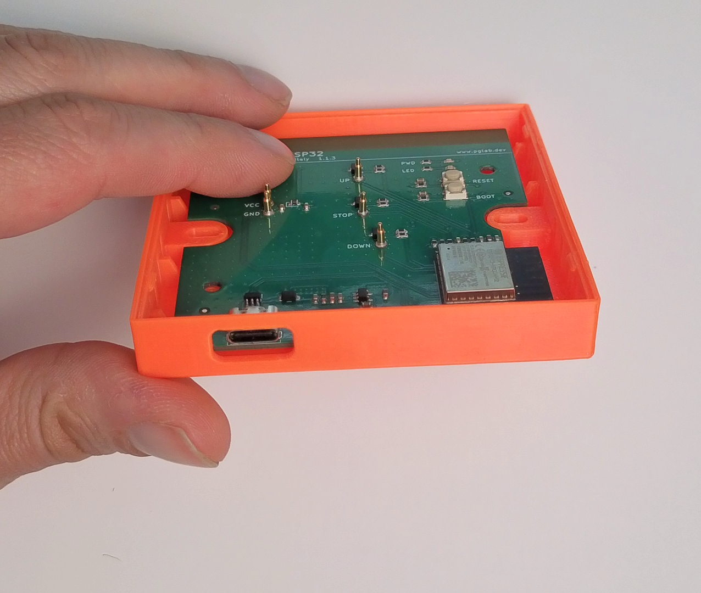

# 3D Print the Enclosure

{: .center width="512"}

The **STL** file of the enclosure is available [here](https://github.com/pglab-electronics/e-vlxesp32/tree/main/stl).

For best results, print the enclosure using **PETG** filament with a 0.2 mm layer height and 30% infill. **PETG** is recommended for its slight flexibility and durability, which helps achieve a reliable snap-fit assembly and long-term mechanical stability.

Supports are required for all parts to guarantee clean overhangs and a precise final geometry, ensuring the enclosure can snap-fit properly with the **VELUX®** remote cover.

The model is designed with tight tolerances for a precise fit. Depending on your printer calibration, you may need to slightly scale the enclosure up or down if the fit is too tight or too loose.

If the fit is too tight, avoid forcing the **VELUX®** cover onto the enclosure, as excessive pressure may damage or break the snap-fit mechanism.

When the 3D print is finished, remove all support.
Verify now that the cover can snap fit with out any problem.

{: .center width="512"}

At this point insert the E-VLXESP32 electronic board, and use the two screws to secure the board to the enclosure.
Be sure to align correctly the PCB to the enclosure as show in the following picture.

{: .center width="512"}

At this point you are ready to snap fit the **VELUX®** cover.

{: .center width="512"}