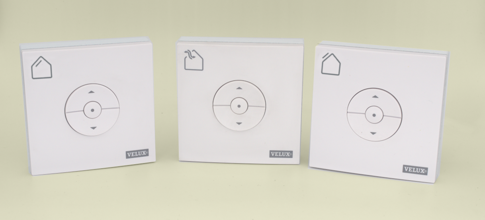
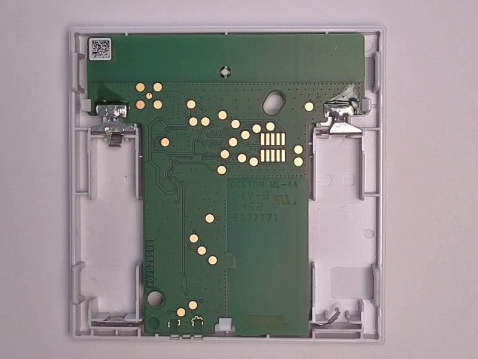

# Compatibility of **VELUX®** wall remote control

**E-VLXESP32** is compatible **only** with the following **VELUX®** wall remote models:

- **KLI311**
- **KLI312**
- **KLI313**

{: .center }

Fig. 1 – KLI311, KLI312, KLI313

---

!!! danger "Important"
    Connecting an incompatible **VELUX®** remote control may permanently damage both the remote and the **E-VLXESP32**.

## Verify PCB compatibility

Ensure that the PCB on the back of your **VELUX®** remote matches the image below.
All gold-plated pads must be in the same position.

!!! danger
    If the PCB layout does **not** match, **do not connect** the remote to **E-VLXESP32**.

{: .center }

Fig. 2 – Compatible PCB layout

### Disclaimer

!!! Important Disclaimer

    The E-VLXESP32 is an independent third-party product developed and manufactured by PG LAB Electronics S.R.L.S. It is not affiliated with, endorsed by, or sponsored by VELUX A/S or any of its subsidiaries or affiliates.

    VELUX® is a registered trademark of its respective owner. All references to VELUX® products, including compatible remote control models, are made solely for the purpose of indicating compatibility.

