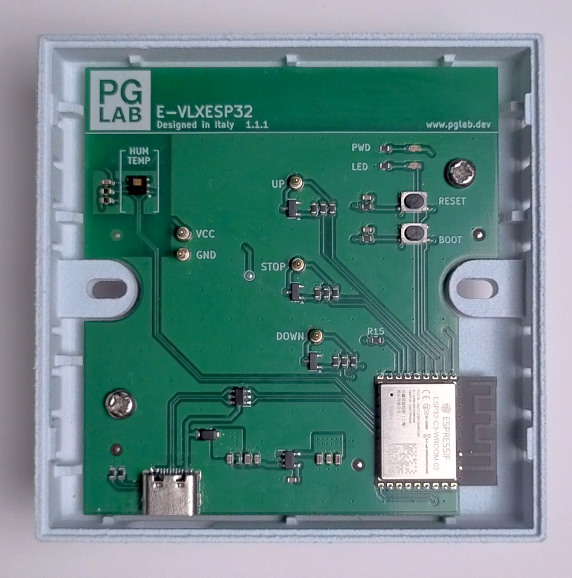
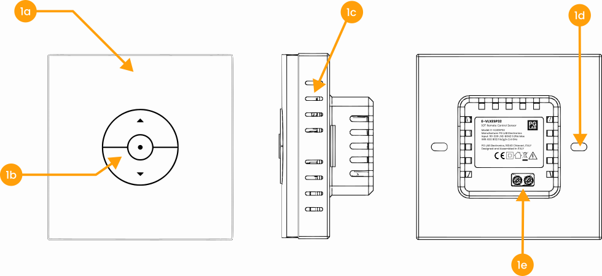
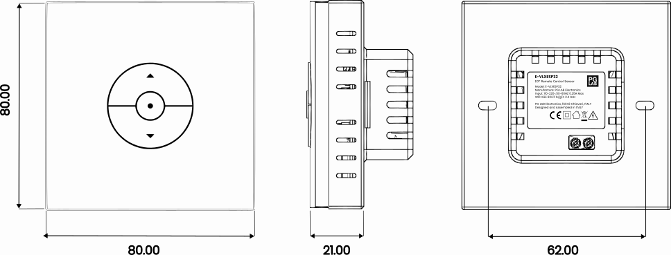
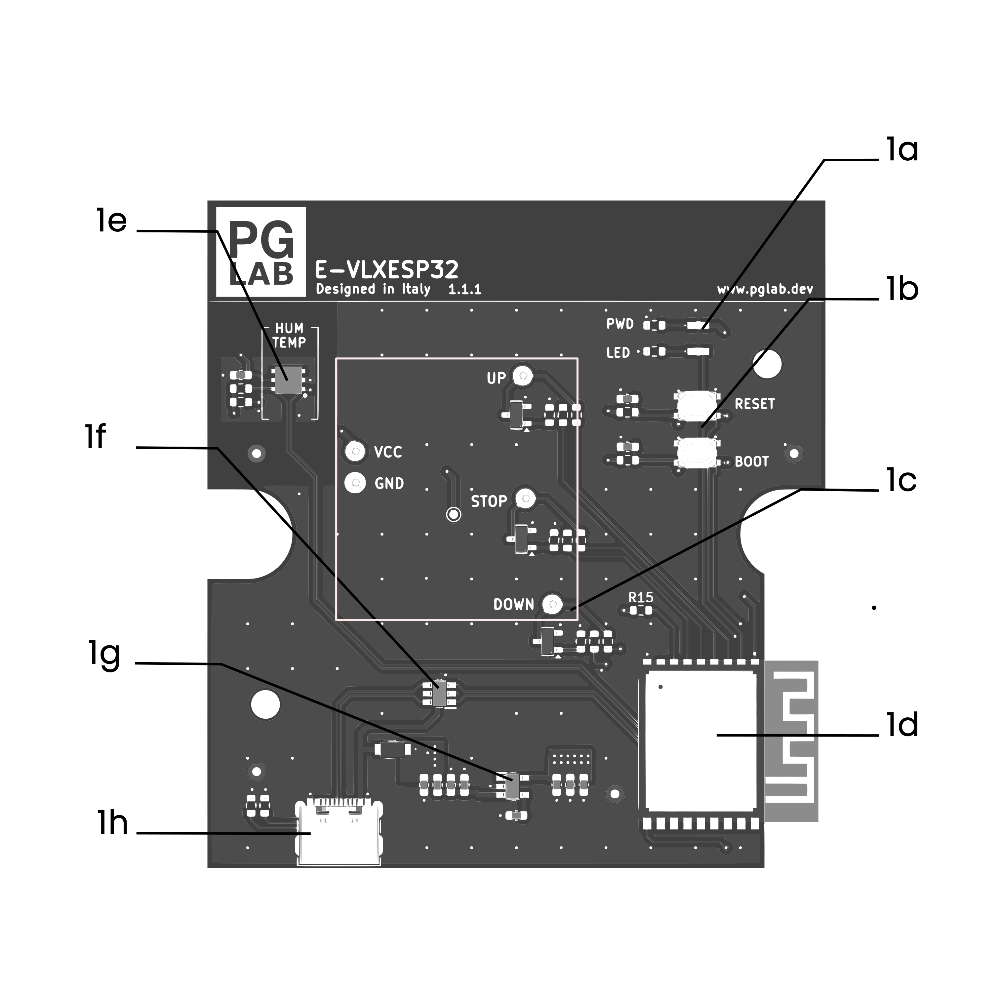
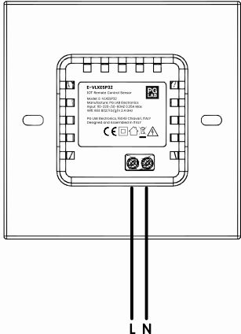

# E-VLXESP32

{: .center width="512"}

## Description

The **E-VLXESP32** is a compact electronics module featuring an integrated **temperature and humidity sensor**.
  
It is designed to interface with battery-powered **VELUX®** wall remote controls **(*)** (models **KLI311, KLI312, KLI313**) and allows users to explore and test smart automation for remotely controlling **VELUX®** motorized skylight windows.

The E-VLXESP32 connects seamlessly to your Home Assistant system over WiFi. Powered by ESPHome, it automatically detects all sensors and features, letting you create dashboards and automations in just minutes—without any complicated setup.

---

## Specification

The following table shows the **general specifications** of the **E-VLXESP32**.

| **Feature**                | **Details**                                |
|-----------------------------|--------------------------------------------|
| MPU                         | ESP32-C3                                   |
| Flash Memory                | 4 MB                                       |
| Circuit Operating Voltage   | 3.3 V                                      |
| Communication               | Wi-Fi 802.11 b/g/n 2.4 GHz                |
| Ambient Sensor              | HDC1080                                    |
| Protection                  | ESD protection on USB-C port               |
| Protection Rating           | IP20                                       |
| Certifications              | CE, RoHS                                   |

---

## Electrical Information

| **Parameter**           | **Details**                               |
|-------------------------|-------------------------------------------|
| Standard Input Voltage  | 220 VAC, 50–60 Hz                          |
| Power Consumption       | < 0.5 W                                    |
| Neutral Wire Required   | No                                         |
| Protection              | Transient protected                        |

---

## Functional Overview

{: .center}

E-VLXESP32 views.

 

| **Ref.** | **Description**                                      |
|----------|------------------------------------------------------|
| 1a       | **VELUX® remote cover** **(*)**                      |
| 1b       | Control buttons                                      |
| 1c       | Ventilation grid                                     |
| 1d       | Mounting holes                                       |
| 1e       | Power supply terminal                                |

**(*)** The **VELUX®** remote cover is **not included** with the E-VLXESP32 and must be provided by the customer.

---

## Mechanical Information

{: .center}

E-VLXESP32 outline (dimensions in mm).

 

| **Description**       | **Value**                    |
|-----------------------|------------------------------|
| Mounting Type         | Wall box                     |
| Mounting Width        | 501 Wall Box Compatible      |
| Width                 | 80 mm                        |
| Height                | 80 mm                        |
| Depth                 | 39 mm                        |
| Weight                | 80 g                         |

---

## Operation Conditions

The **E-VLXESP32** must operate under the following conditions:

| **Parameter**            | **Min.**           | **Max.**           |
|--------------------------|------------------|------------------|
| Input Voltage            | 110 VAC          | 240 VAC          |
| Input Frequency          | 50 Hz            | 60 Hz            |
| Ambient Temperature      | -20 °C           | 70 °C            |
| Humidity                 | Non-condensing   | Avoid icing      |
| Positioning              | No direct sunlight | Keep away from heat sources |
| Protection Rating        | IP20             |                  |

---

## Board Topology

{: .center}

E-VLXESP32 Circuit Top View

 

| **Ref.** | **Name**                 | **Description**                                                       |
|----------|--------------------------|-----------------------------------------------------------------------|
| 1a       | LEDs                     | Power LED (red), User LED (green)                                     |
| 1b       | Buttons                  | Tactile switches for reset and bootloader mode                        |
| 1c       | Pogo Pins                | Gold-plated pins for solderless connection to **VELUX®** remote       |
| 1d       | ESP32-C3                 | Single-core Wi-Fi module                                              |
| 1e       | HDC1080                  | High-accuracy digital temperature and humidity sensor                 |
| 1f       | ESD                      | Data line ESD protection                                              |
| 1g       | LDO                      | Low-noise voltage regulator                                           |
| 1h       | USB-C                    | Flashing firmware and powering the board                               |

---

## GPIO Pinout

| **Pin**    | **Function.**           |
|------------|-------------------------|
| GPIO02     | I2C SCL                 |
| GPIO03     | I2C SDA                 |
| GPIO01     | Pogo Pin DOWN switch    |
| GPIO07     | Pogo Pin STOP switch    |
| GPIO05     | Pogo Pin UP switch      |
| GPIO10     | User Green Led          |

---

## Wiring Diagram

{: .center}

E-VLXESP32 connected to the AC power line

 

---

## Setup and Use

!!! danger "Read before installation"
    Before beginning installation, **read this documentation carefully and completely**.  
    Failure to follow recommended procedures may result in **device malfunction, serious injury, or violation of local electrical regulations**.

!!! warning "High voltage – qualified personnel only"
    Installation involves **high AC voltage** and must be carried out by a **qualified electrician**.

!!! caution "Handling"
    - Connect the E-VLXESP32 **only as shown** in these instructions.  
    - Ensure all power sources are **disconnected** before any wiring changes.  
    - Do not remove or attach the **VELUX®** front cover while power is connected.  
    - Do not use the device if it has been damaged.  
    - Do not attempt to repair or service the device yourself.  
    - Keep the device away from children.

!!! Important "Environment"
    Do not install the device where it may get wet, in direct sunlight, or near heat sources.  

---

## Certification

PG LAB Electronics S.R.L.S declares, under sole responsibility, that **E-VLXESP32** complies with the following **EU Directives** and
therefore qualifies/qualify for free movement within markets comprising the **European Union (EU)** and **European Economic Area (EEA)**.

**RoHS Directive 2011/65/EU:**

- EN IEC 62311:2020  

**Directive 2014/30/UE (EMC):**

- EN IEC 63044-5-1:2019/A1:2024  
- EN IEC 63044-5-2:2019/A1:2024  
  
**Radio Equipment Directive (RED) 2014/53/UE:**

**EMC (RED Article 3.1b):**

- EN 301 489-1 V2.2.3:2019  
- EN 300 328 V2.2.2:2019  

### Disclaimer

!!! Important Disclaimer

    The E-VLXESP32 is an independent third-party product developed and manufactured by PG LAB Electronics S.R.L.S. It is not affiliated with, endorsed by, or sponsored by VELUX A/S or any of its subsidiaries or affiliates.

    VELUX® is a registered trademark of its respective owner. All references to VELUX® products, including compatible remote control models, are made solely for the purpose of indicating compatibility.

