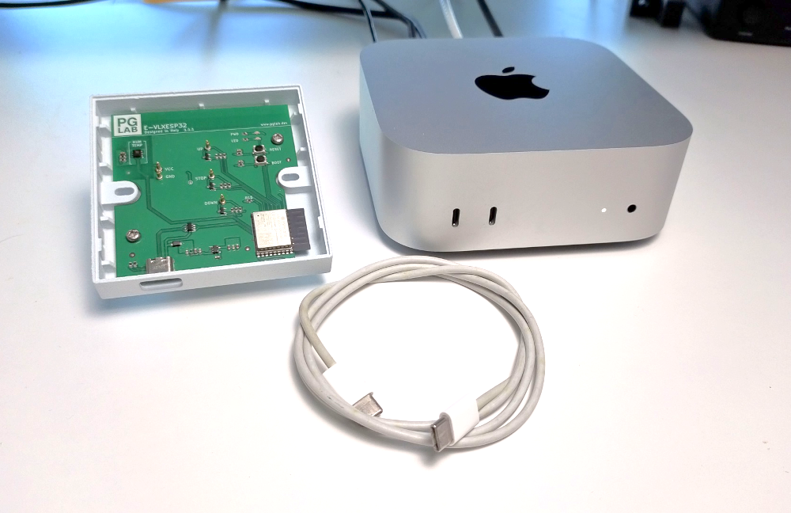
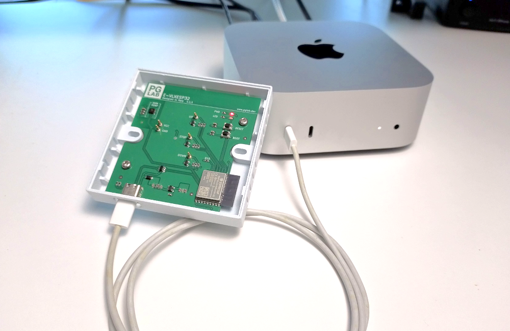

# Flashing the Firmware

This guide explains how to flash the **E-VLXESP32 firmware** to control it from **Home Assistant** over your local Wi-Fi network.  

Flashing is straightforward, and you can use either the **Command Line** or **Home Assistant add-on** method.

---

## What You Need

!!! note "Required Items"
    - E-VLXESP32 device  
    - USB-C cable  
    - A computer **(*)** to build and upload the firmware

{: .center}

<p style="text-align: center; font-weight: bold">Fig. 1 – Hardware</p>

**(*)** You can use any computer with WINDOWS/LINUX/OSX or any device able to run HomeAssistant.

---

## Safety Warnings

!!! warning "Important Safety Precautions"
    - Do **not** connect E-VLXESP32 to mains power (110/220V AC) during flashing.  
    - Do **not** connect the VELUX front cover during flashing.  
    - Only connect the VELUX front panel after flashing is complete and the USB-C cable is removed.  
    - Do **not** insert any batteries.

---

## Option 1: Command Line

### Step 1: Install ESPHome CLI

Follow the instructions to install the **ESPHome Command Line Tool** at this [link](https://esphome.io/guides/installing_esphome/).

Verify Installation, open a terminal and run:

```bash
$ esphome --version
```

Expected output:

```text
Version: 2025.8.0
```

---

### Step 2: Configure Your Device

1. Download **evlxesp32.yaml** YAML file from this [link](https://github.com/pglab-electronics/e-vlxesp32).  
2. Open it in a text editor.
3. Update and save the file as described in this steps.

#### Update Device Name

Each device must have a **unique name**. This name is used in Home Assistant and to access the internal device web server:

```yaml
esphome:
  name: evlxesp32
```

#### Update Home Assistant API Key

Each device must have a **unique API key**. Generate one [here](https://esphome.io/components/api/) (see **encryption** section):

```yaml
api:
  encryption:
    key: "pQUjUzzg6T7NuOX4uYN6v4XvBkFcAQHzmYbr63DFmD4="
```

#### Set Wi-Fi Credentials

Replace with your network credentials:

```yaml
wifi:
  ssid: "WIFI_SSID"
  password: "WIFI_PASSWORD"
```

---

### Step 3: Flash the Firmware

Connect E-VLXESP32 to your computer with the USB-C cable as show in Fig. 2.

{: .center}

<p style="text-align: center; font-weight: bold">Fig. 2 – USB cable</p>

Open a terminal windows and run:

```bash
$ esphome run evlxesp32.yaml
```

When prompted, select **USB JTAG/Serial** option as show in Fig. 3.

{: .center }

<p style="text-align: center; font-weight: bold">Fig. 23 – Terminal window</p>

---


## Option 2: Home Assistant add-on
Add missing information


---

## Verify Connection
After few minutes E-VLXESP32 is connecting to your local WIFI. You should be able to connect to the internal web server typing on your browser the following:
http://evlxesp32.local


Flashing the Firmware
=====================

This chapter explain how to flash the E-VLXESP32 firmware.

Flashing the firmware is needed to be able to control E-VLXESP32 from HomeAssistant in your local WIFI network.
It’s a straightforward process, and you can choose the method you’re most comfortable with.

Please be sure to follow carefully the following instructions.

:warning: **Warning** Don't connect E-VLXESP32 to the power 110/220 AC line

:warning: **Warning** Don't connect the VELUX front cover

The following picture show what is needed.


You can flash the firmware either:

- From the command line on your terminal window.
  
- Using Home Assistant with the ESPHome Builder add-on, or

Command Line
------------

Installing Command Line Tool
----------------------------

The following steps describe how to install [ESPHome command line tool](https://esphome.io/guides/installing_esphome/) on your machine.

You should be able now to confirm that ESPHome has been successfully installed.
Open your terminal window and type:

``` yaml
$ esphome --version
```

you should see something like:

``` yaml
Version: 2025.8.0
```

Configuration file
------------------

The E-VLXESP32 configuration file is available [here](https://github.com/pglab-electronics/e-vlxesp32).
Download and open it with your text editor.
You have to do the following change.

If needed, rename your E-VLXESP32 device. This is the name that is going to be show in home assistant and it's the name used to the access of the internal web server.
Be sure to use a different name for every E-VLXESP32 device in your home configuration.

```yaml
esphome:
  name: evlxesp32
```

If needed, replace HomeAssistant API key.
The key must be unique for every E-VLXESP23 device in your home setup.
Use the following [link](https://esphome.io/components/api/) to generate a new key.


```yaml
api:
  encryption:
    key: "pQUjUzzg6T7NuOX4uYN6v4XvBkFcAQHzmYbr63DFmD4="
```

Replace the following with the credential to connect to your local WIFI network.

```yaml
wifi:
  ssid: "WIFI_SSID"
  password: "WIFI_PASSWORD"
```

Flash the Firmware

Connect E-VELUX to your computer using a USB cable.

Open a terminal and run:

```yaml
esphome run evlxesp32.yaml
```

ESPHome will compile the firmware. When prompted, choose the option to upload the firmware via the USB port.

Done !!!

After few minutes E-VLXESP32 is connecting to your local WIFI. You should be able to connect to the internal web server typing on your browser the following:
http://evlxesp32.local

You should be able to see a page similar to the following.
From here you can monitor environment humidity, temperature and control the VELUX skylight.
E-VLXESP32 has also a green led used for test purpose.

To confirm that every things works properly you should be able to toggle the LED state as show here.


HomeAssistant Add On
-------------

ESPHome.... builder

Final note
----------
If you don't want to expose the control of the green led to HomeAssistant change the yaml configuration file replace:

```yaml
platform: gpio
  pin: GPIO10
  name: "Led Green"
```

with

```yaml
platform: gpio
  pin: GPIO10
  name: "Led Green"
  internal: true
```

From you terminal overwrite the firmware running:

```yaml
esphome run evlxesp32.yaml
```


⚠️ Important Safety Notes:

Only connect the VELUX remote front panel when E-VLXESP32 is NOT connected to the USB cable.

Do NOT insert any batteries.