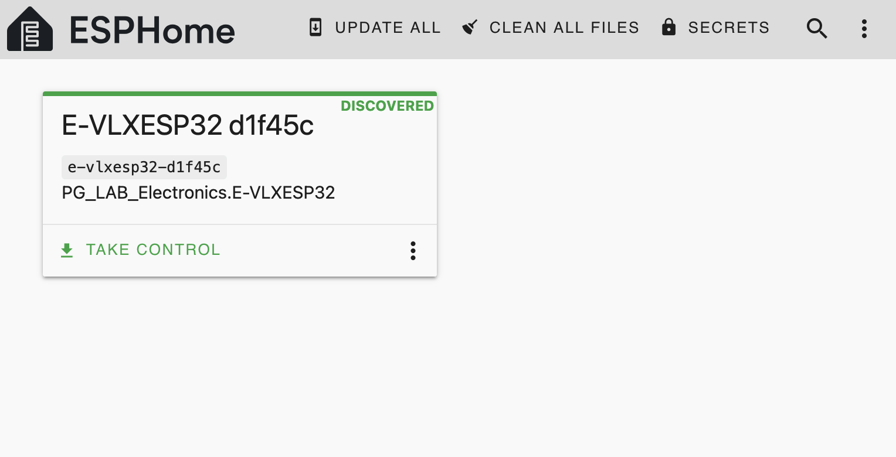
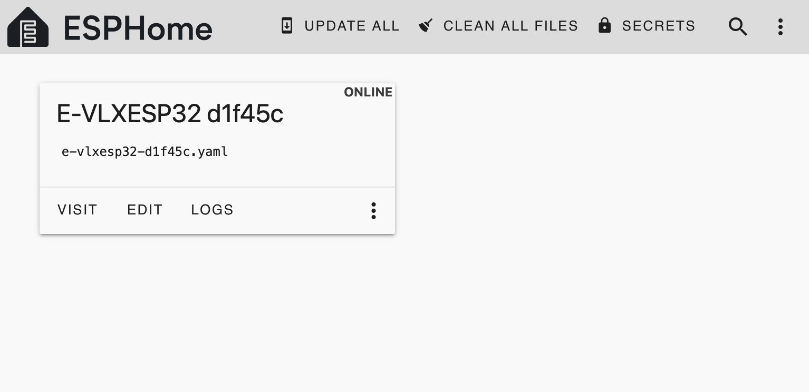
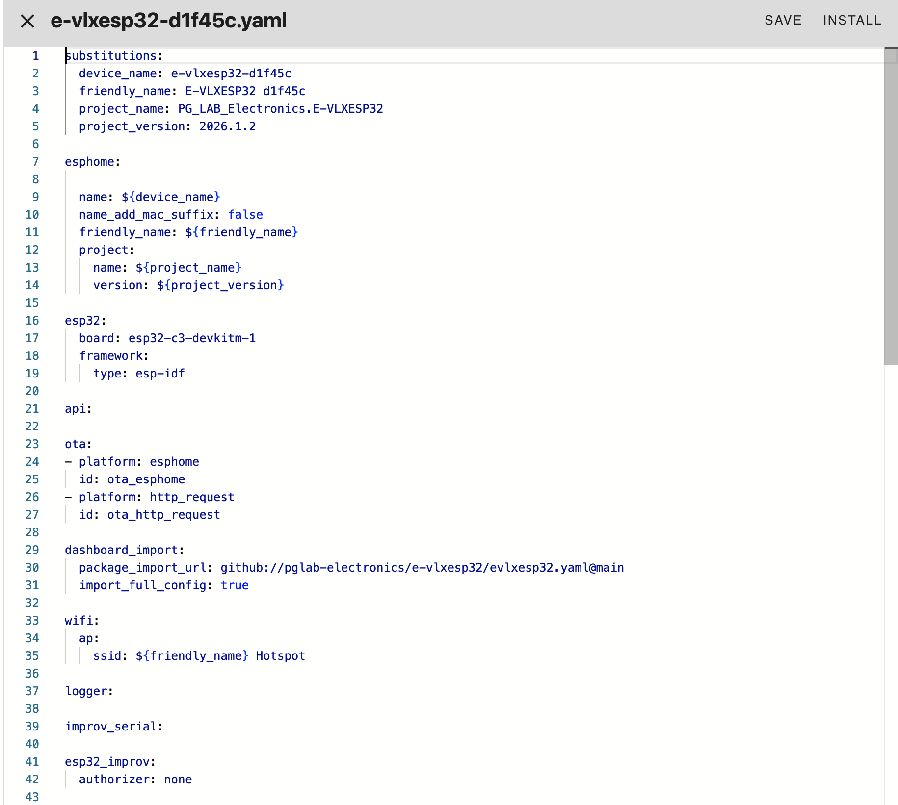
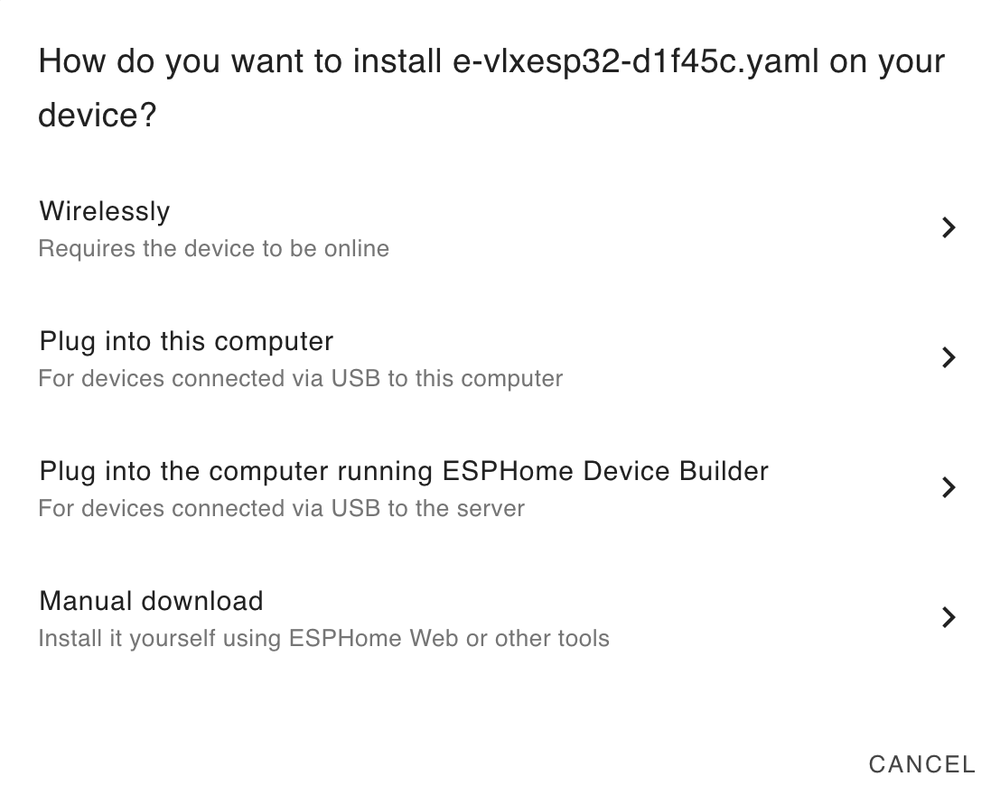
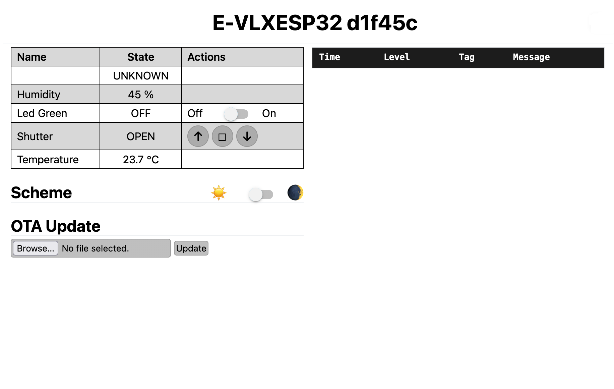

# Flashing the Firmware

This guide explains how to flash the **E-VLXESP32 firmware** to control it from **Home Assistant** over your local Wi-Fi network.  

Flashing is straightforward, and you can use either the **Command Line** or **Home Assistant add-on** method.

---

## What You Need

!!! note "Required Items"
    - E-VLXESP32 device  
    - USB-C cable  
    - A computer **(*)** to build and upload the firmware

{: .center}

<p style="text-align: center; font-weight: bold">Fig. 1 – Hardware</p>

**(*)** You can use any computer with WINDOWS/LINUX/OSX or any device able to run HomeAssistant.

---

## Safety Warnings

!!! warning "Important Safety Precautions"
    - Do **not** connect E-VLXESP32 to mains power (110/220V AC) during flashing.  
    - Do **not** connect the VELUX front cover during flashing.  
    - Only connect the VELUX front panel after flashing is complete and the USB-C cable is removed.  
    - Do **not** insert any batteries.

---

## Option 1: Command Line

### Step 1: Install ESPHome CLI

Follow the instructions to install the **ESPHome Command Line Tool** at this [link](https://esphome.io/guides/installing_esphome/).

Verify Installation, open a terminal and run:

```bash
$ esphome --version
```

Expected output:

```text
Version: 2025.8.0
```

---

### Step 2: Configure Your Device

1. Download the **evlxesp32.yaml** file from this [link](https://github.com/pglab-electronics/e-vlxesp32).  
2. Open it in a text editor.
3. Modify and save the file according to your needs.

You can fully customize this configuration to match your setup. For example, you can update the device name, Home Assistant API settings, Wi-Fi credentials, and any other parameters supported by ESPHome.

#### Update Device Name

Each device must have a **unique name**. This name is used in Home Assistant and for accessing the internal device web server:

```yaml
esphome:
  name: evlxesp32
```

#### Update Home Assistant API Key

Each device must have a **unique API key**. Generate one [here](https://esphome.io/components/api/) (see **encryption** section):

```yaml
api:
  encryption:
    key: "pQUjUzzg6T7NuOX4uYN6v4XvBkFcAQHzmYbr63DFmD4="
```

#### Set Wi-Fi Credentials

Replace with your own network credentials:

```yaml
wifi:
  ssid: "WIFI_SSID"
  password: "WIFI_PASSWORD"
```

---

### Step 3: Flash the Firmware

Connect E-VLXESP32 to your computer with the USB-C cable as show in Fig. 2.

{: .center}

<p style="text-align: center; font-weight: bold">Fig. 2 – USB cable</p>

Open a terminal windows and run:

```bash
$ esphome run evlxesp32.yaml
```

When prompted, select **USB JTAG/Serial** option as show in Fig. 3.

{: .center }

<p style="text-align: center; font-weight: bold">Fig. 23 – Terminal window</p>

---

## Option 2: Home Assistant add-on

Home Assistant includes an add-on called **ESPHome Builder**.

With this add-on, you have full control over your ESPHome devices. Click on the discovered device and select **TAKE CONTROL**.

{: .center width="512"}

Home Assistant will download the **E-VLXESP32** YAML configuration file from the GitHub repository, along with all required dependencies needed to compile and flash the firmware.

This step may take some time on certain systems.

When finished, you should be able to see your **E-VLXESP32** device **ONLINE**.

{: .center width="512"}


Click **EDIT**, modify the configuration according to your needs, then click **SAVE & INSTALL** to flash the firmware.

{: .center width="512"}

The **E-VLXESP32** supports OTA updates, so you can flash new firmware without a physical USB connection.
In this case click **Wirelessly** when HomeAssistant ask how to flash the update firmware.

{: .center width="512"}

---

## Verify Connection

When the firmware is been flashed, the device reboot.
After few minutes **E-VLXESP32** is connecting to your local WIFI. You should be able to connect to the internal web server typing on your browser the device name as the following:

    http://e-vlxesp32-d1f45c.local

You should be able to see a page similar to the following.

{: .center  width="512"}

From here you can monitor environment humidity, temperature and control the **VELUX®** skylight.

 **E-VLXESP32** has also a green led used for test purpose.

To confirm that every things works properly you should be able to toggle the LED state as show here.

## Final note

The green LED (user LED) is used to confirm that the device is connected and responsive.

You can toggle the LED state as shown below to verify that the **E-VLXESP32** is working correctly.

If you do not want to expose control of the green LED to Home Assistant, modify the YAML configuration file and remove or adjust the following section:

```yaml
platform: gpio
  pin: GPIO10
  name: "Led Green"
```

with

```yaml
platform: gpio
  pin: GPIO10
  name: "Led Green"
  internal: true
```
