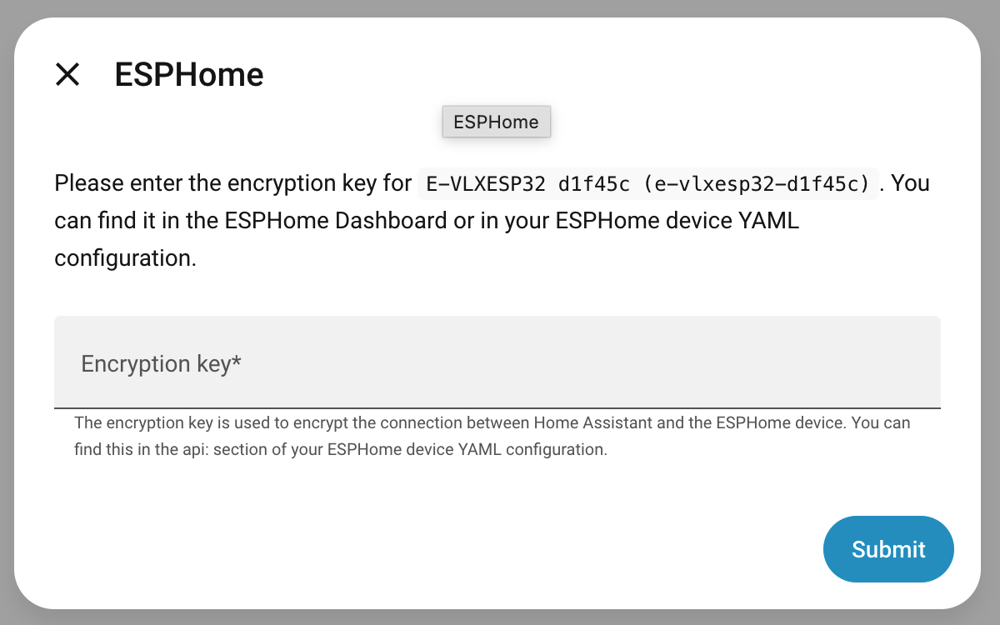
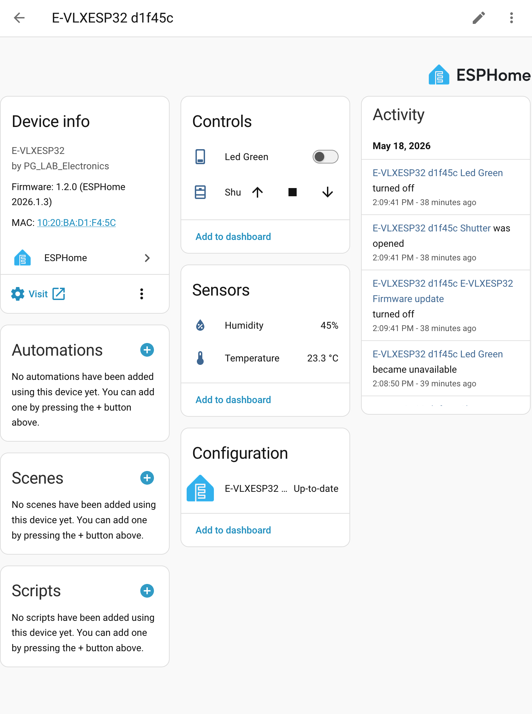

HomeAssistant
=======

## Introduction

This page is going to show only how to configure HomeAssistant in order to be able to use E-VLXESP32.
This documentation suppose that you have already a device running HomeAssistant in your local network.

If you need to setup new device with Home Assistant please follow the instruction at this [link](https://www.home-assistant.io/installation/)

## Features

E-VLXESP32 can be controlled by HomeAssistant.

In HomeAssistant you can use automation to control your **VELUX®** skylight window.
Or you can control the **VELUX®** skylight directly from HomeAssistant user interface.

E-VLXESP32 is able to communicate HomeAssistant about the environment temperature and humidity.

## Configuration

The ESPHome integration needs to be installed in order to communicate directly with E-VLXESP32 by the following steps:

- In your browser connect to your Home Assistant web page
- Go to Settings>Device & Services
- On bottom on the page click Add integration
- Search and Select ESPHome

For more information please see the following [link](https://www.home-assistant.io/integrations/esphome/).

## Add E-VLXESP32 device

When the ESPHome integration is installed, Home Assistant can automatically discover a new **E-VLXESP32** connected to your local network.

Follow these steps to add a new device:

- In your browser, open your Home Assistant web interface
- Go to **Settings > Devices & Services**
- At the top of the page, under the **Discovered** section, you should see your **E-VLXESP32** device
- Click **Add** and proceed to add the device to Home Assistant

!!! note
    With some older **E-VLXESP32** firmware versions, Home Assistant may request an API **Encryption Key**:

    { width="512", align="center" }

    In this case, enter:

    ```
    pQUjUzzg6T7NuOX4uYN6v4XvBkFcAQHzmYbr63DFmD4=
    ```

    Newer firmware versions do not require any encryption key.

- In your browser connect to your Home Assistant web page
- Go to Settings>Device & Services
- On top of the page under Discovered section you should see your E-VLXESP32 device
- Click Add

{: .center width="512"}

- Home Assistant should ask the **Encryption Key**
- Please enter:
  
        pQUjUzzg6T7NuOX4uYN6v4XvBkFcAQHzmYbr63DFmD4=

Congratulations — the **E-VLXESP32** is now fully integrated into Home Assistant.

## Use E-VLXESP32

Open ESPHome integration to see the new device.
You should see something like the following image.

{ width="512", align="center" }

On the Controls Tab you have all the actions to operate the **VELUX®** skylight windows.
On the Sensors Tab you can read the environment Temperature and Humidity.

Try to push the open button, your skylight should open.

Now you can personalize your HomeAssistant UI to expose the E-VLXESP32 controls and sensor as you like.

## Automation

E-VLXES32 can be integrate in HomeAssistant automation.
The following script show a simple example:
at 8.00 am the **VELUX®** skylight is opened and after a delay of 5 minutes is closed.

```yaml
description: "opening and closing"
mode: single
triggers:
  - trigger: time
    at: "08:00:00"
conditions: []
actions:
  - action: cover.open_cover
    metadata: {}
    target:
      entity_id: cover.e_vlxesp32_d1f45c_shutter
    data: {}
  - delay:
      hours: 0
      minutes: 5
      seconds: 0
      milliseconds: 0
  - action: cover.close_cover
    metadata: {}
    target:
      entity_id: cover.e_vlxesp32_d1f45c_shutter
    data: {}
```

## Note:

It's possible to operate multiple **VELUX®** skylight windows with HomeAssistant.
However it's recommended to add short delay of few millisecond before to control other skylight windows.
We noticed sometime interference between **VELUX®** remote and **VELUX®** receiver when multiple remotes are activated at the same time.
This is easily resolved with a short delay as show in the following automation as show in the following:

```yaml
  - delay:
      hours: 0
      minutes: 0
      seconds: 2
      milliseconds: 0
```
