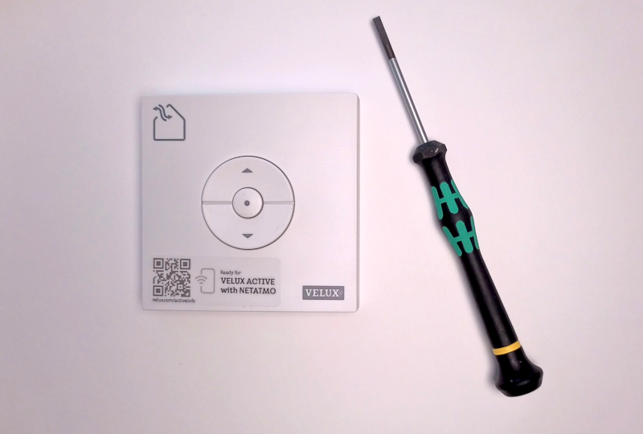
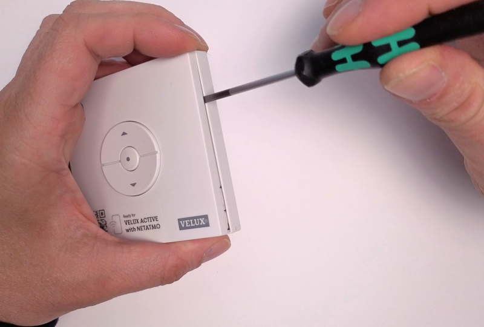
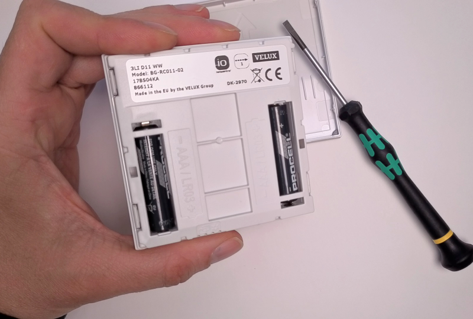
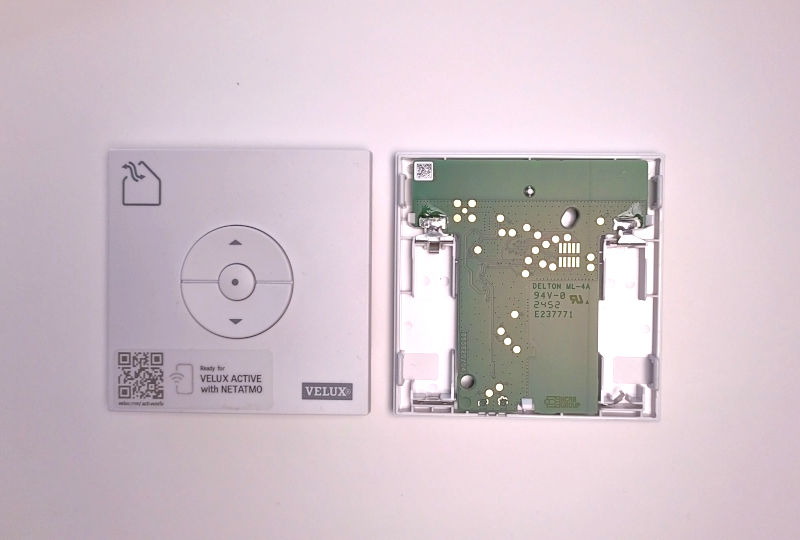

# Preparing **VELUX®** wall remote control

This chapter explains how to prepare a **VELUX®** wall remote control before connecting it to **E-VLXESP32**.

**E-VLXESP32** is compatible **only** with the following **VELUX®** wall remote models:

- **KLI311**
- **KLI312**
- **KLI313**

!!! danger "Important"
    Connecting an incompatible **VELUX®** remote control may permanently damage both the remote and the **E-VLXESP32**.

!!! warning "Before you start"
    Ensure that your **VELUX®** wall remote control is correctly paired with your **VELUX®** motorized skylight window.

!!! note
    Follow the official **VELUX®** remote control manual to pair a new remote with the skylight window.

Before proceeding, verify that you can **open, close, and stop** the skylight window using the wall remote buttons.

---

## Required tool

You will need a **small flat-head screwdriver**.

*Fig. 1 – Small flat-head screwdriver*

---

## Step 1 – Remove the back cover

Using the screwdriver, carefully remove the back cover from the **VELUX®** remote control.

*Fig. 2 – Back cover removal*

---

## Step 2 – Remove the batteries

Remove any batteries from the remote control.

!!! caution
    Always remove the batteries before connecting the remote.  
    Leaving batteries installed may damage the **E-VLXESP32**.

!!! note
    Batteries are **no longer required**.  
    The **E-VLXESP32** powers the **VELUX®** remote via pogo pins.

*Fig. 3 – Battery removal*

---

## Step 3 – Remove the battery holder

Carefully remove the battery holder from the back of the front cover.
Use the screwdriver to gently release the snap-fit mechanism.

!!! caution
    Do not damage the snap-fit mechanism.

!!! danger
    If the snap-fit mechanism is damaged, **do not connect** the **VELUX®** remote to **E-VLXESP32**.
    Misaligned pogo pins may cause electrical damage or malfunction.

*Fig. 4 – Battery holder removal*

---

## Step 4 – Verify PCB compatibility

Ensure that the PCB on the back of your **VELUX®** remote matches the image below.
All gold-plated pads must be in the same position.

!!! danger
    If the PCB layout does **not** match, **do not connect** the remote to **E-VLXESP32**.

*Fig. 5 – Compatible PCB layout*

---

## Completion

Congratulations!  
Your **VELUX®** wall remote control is now ready to be connected to **E-VLXESP32**.

*Fig. 6 – Remote ready for connection*

## Next Step

Precede with [wall installation](wall-installation.md).
