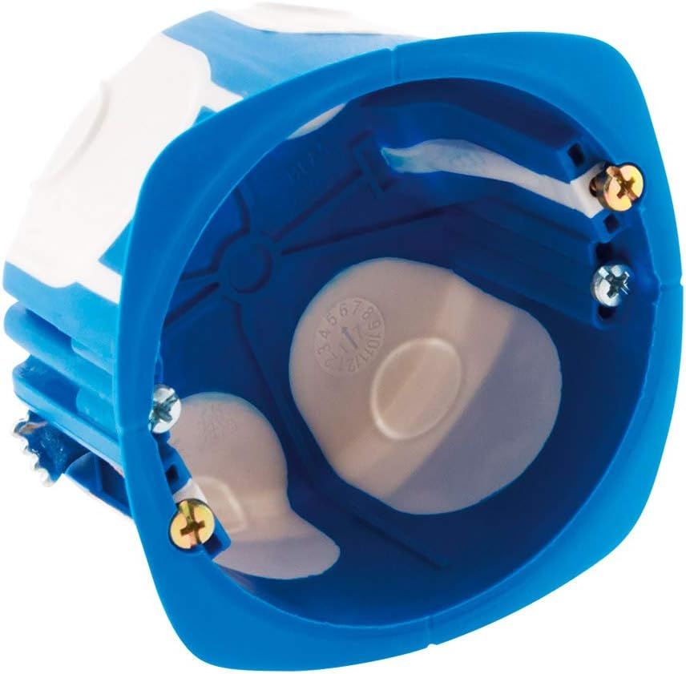

# Hardware requirements

## Required components

You will need the following items:

- One **E-VLXESP32**
- One **VELUX®** wall remote control (models **KLI311, KLI312, KLI313**)
- One USB-C cable
- One **501 recessed wall box** for drywall or solid walls  
  (diameter: 67 mm / depth: 40 mm)
- One small **flat-head screwdriver**

The following product is our recommended 501 wall box.  
Equivalent wall boxes with the same dimensions may also be used.

At this [link](https://amzn.eu/d/0Us88Tq) the recommended wall box.

{ width=256  }

*Fig. 1 – 501 recessed wall box*

