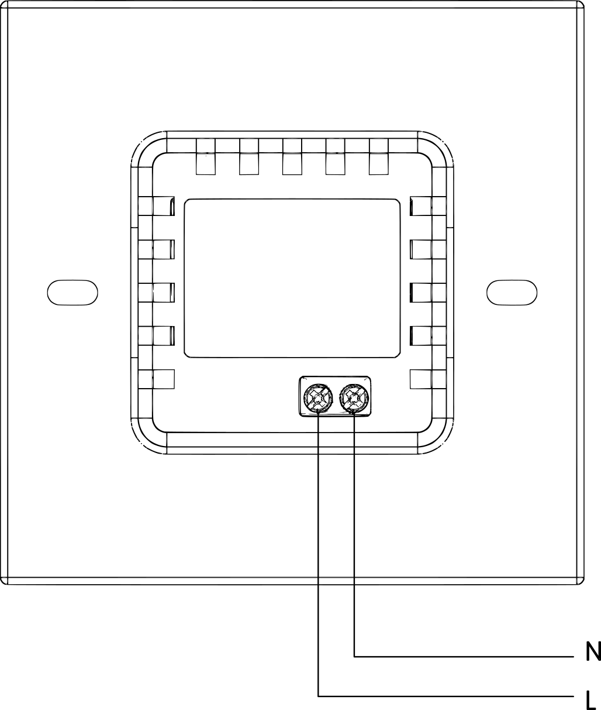
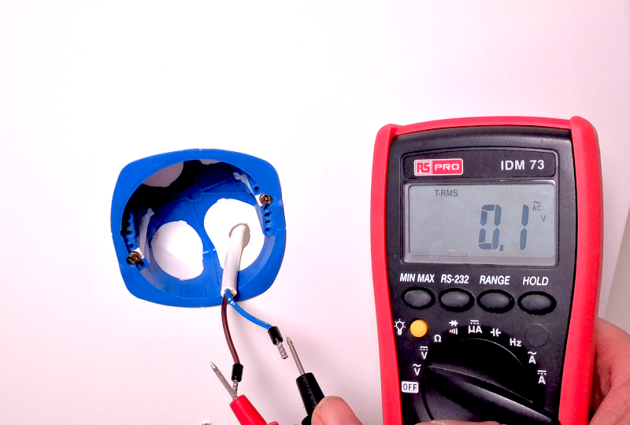
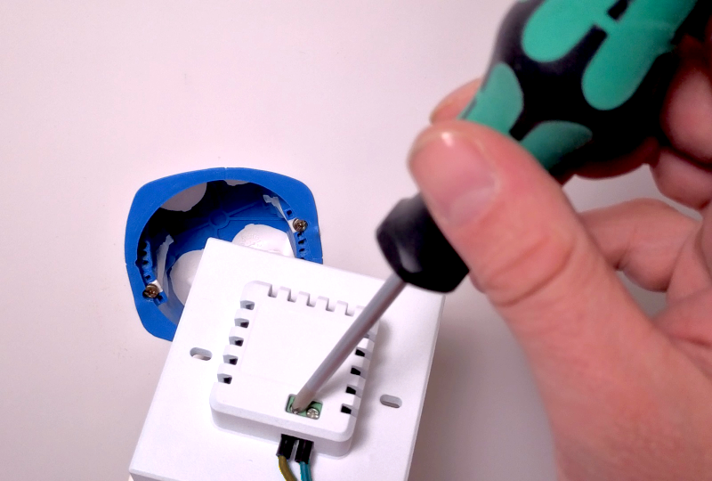
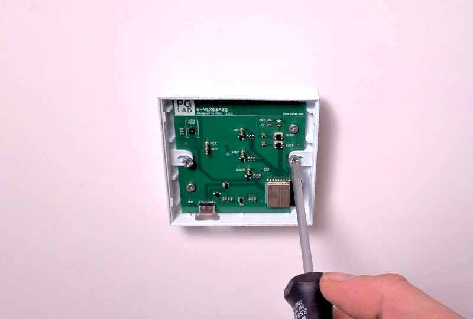
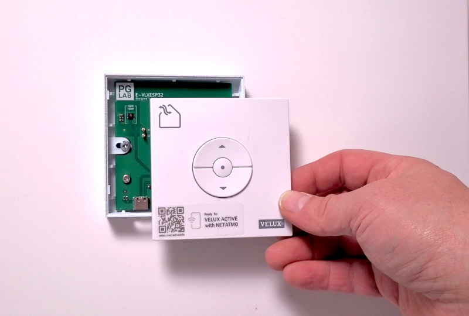
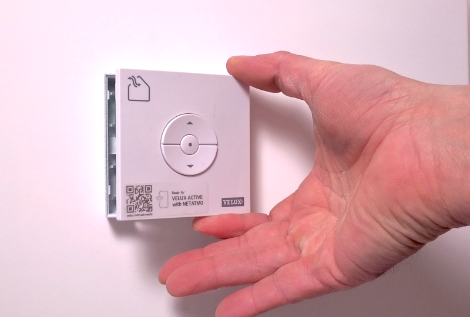
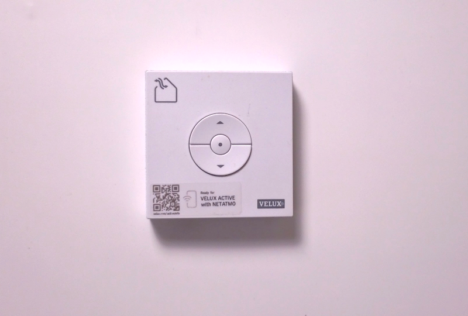

# Wall Installation

!!! danger "Read before installation"
    Before beginning the installation, read this documentation **carefully and completely**.
    Failure to follow the recommended procedures may result in **serious injury, death, property damage, or violation of local electrical regulations**.

    PG LAB Electronics is not responsible for any loss or damage resulting from incorrect installation or operation of this device.

!!! danger "High voltage – qualified personnel only"
    Installation of the **E-VLXESP32** involves **high AC voltages** and **must be carried out by a qualified electrician**.
    There is a serious risk of electrocution.

!!! warning
    Connect the **E-VLXESP32** **only** as shown in these instructions. Any other wiring method may cause damage or injury.

!!! warning
    Any changes to wiring connected to the screw terminals must be performed **only after all local power sources have been switched off and disconnected**.

!!! warning
    The **VELUX®** front cover must be removed or attached **only when all power sources are disconnected**.

!!! warning
    Do not install the **E-VLXESP32** where it may get wet, exposed to direct sunlight, or near sources of heat.

!!! warning
    Do not use the **E-VLXESP32** if it has been damaged. Do not attempt to service or repair the device yourself.

---

## Basic wiring diagram

The following image shows the power line wiring connections.

{ width=256 align=center }{: .center}

Fig. 1 – Wiring to power line

| **Terminal** | **Wire** |
|-------------|----------|
| **N** | Neutral |
| **L** | Live (100–240 V~, 50/60 Hz) |

---

## Installation

!!! important
    Ensure that the **VELUX®** wall remote control has been prepared as described in the  
    [Preparation](remote-control.md) section before continuing.

Before starting the installation, verify that the circuit breakers are switched **off** and that no voltage is present on the power lines.
Use a phase tester or multimeter to confirm this (Fig. 2).

{: .center}

Fig. 2 – No voltage on the power line

Connect the wires to the **E-VLXESP32** according to the wiring diagram (Fig. 1).

- Connect the **Live** wire to terminal **L**
- Connect the **Neutral** wire to terminal **N**

{: .center}

Fig. 3 – Connecting the wires

Insert the **E-VLXESP32** into the wall box and secure it using the two screws supplied with the box.

!!! warning
    Do not overtighten the screws, as this may damage the plastic enclosure.

{: .center}

Fig. 4 – Wall insertion

Attach the **VELUX®** wall remote control cover by pressing it onto the **E-VLXESP32** until you hear a click.

Fig. 5 – Attaching the cover

{: .center}

Fig. 6 – Snap-fit click

!!! caution
    Be very careful not to bend the **E-VLXESP32** pogo pins when inserting the **VELUX®** wall remote control cover.

---

## Completion

Congratulations! Your **E-VLXESP32** is now installed.

You may now restore power by turning the circuit breakers back on.

{: .center}

Fig. 7 – Installation complete

## Next Step

Precede with [Wi-Fi setup](wifi.md).
