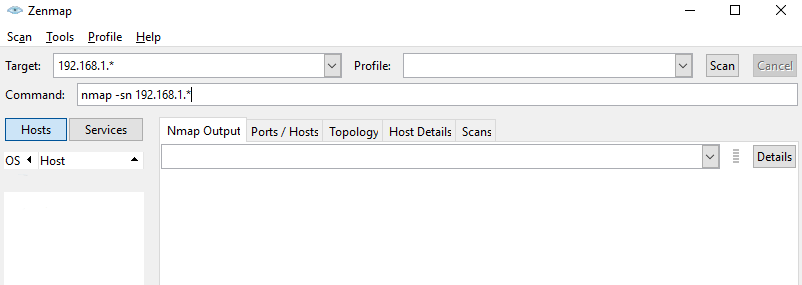

Find Device IP
==============

When powering E-BOARD negotiate the IP address with your router using DHCP.
To perform the initial configuration you need to connect to E-BOARD with a host computer.

Here are some tips to help find E-BOARD IP address:

1. Be sure that all E-BOARD devices are connected to the router/switcher and your computer is connected to the same network.
2. If possible, disconnect all other devices that share the same network so that only your computer and E-BOARD with unknown IP are on the same network.
3. Scan or find the IP address within the subnet.


!!! note

    Save the IP address of E-BOARD for future reference.

On Your Router
--------------
Connect to the Router with a host computer, you should be able to see the list of all attached devices. E-BOARD has a name similar to: 

``` yaml
E-BOARD-AE20B315
```

Take a note of the corresponding IP address.


!!! info

    To access your router please refer to the router manufacture documentation.


On MacOS/Linux
--------------

Open a terminal and run:

``` yaml
$ sudo nmap -sn 192.168.1.*
```

The command scans a range of IP addresses on the {==192.168.x==} subnet.
The output should look similar to:

``` yaml
Starting Nmap 7.95 ( https://nmap.org ) at 2025-01-15 22:40 CET
Nmap scan report for 192.168.1.1
Host is up (0.00029s latency).
MAC Address: 3C:37:86:19:56:16 (Netgear)
Nmap scan report for 192.168.1.7
Host is up (0.0026s latency).
MAC Address: 80:34:28:1B:79:84 (Microchip Technology)
Nmap scan report for 192.168.1.26
Host is up (0.0054s latency).
MAC Address: FC:0F:E7:D8:24:E7 (Microchip Technology)
Nmap scan report for 192.168.1.13
Host is up.
Nmap done: 256 IP addresses (3 hosts up) scanned in 2.09 seconds
```

In this case E-BOARD has an IP {==192.168.1.7==} and IP {==192.168.1.26==}.
While the network adapter of the host computer is {==192.168.1.13==}.

On Windows
----------

We recommend installing the latest version of nmap that comes with a graphical interface.
Download and install the latest stable release self-installer from [nmap.org](https://nmap.org/download).
On your desktop click and execute as administrator the Nmap-Zenmap GUI. 
In the Command field type nmap -sn 192.168.1.* 

<center></center>

Hit Enter on your keyboard, after few seconds the output should look similar to:

``` yaml
Starting Nmap 7.95 ( https://nmap.org ) at 2025-01-15 22:40 CET
Nmap scan report for 192.168.1.1
Host is up (0.00029s latency).
MAC Address: 3C:37:86:19:56:16 (Netgear)
Nmap scan report for 192.168.1.7
Host is up (0.0026s latency).
MAC Address: 80:34:28:1B:79:84 (Microchip Technology)
Nmap scan report for 192.168.1.26
Host is up (0.0054s latency).
MAC Address: FC:0F:E7:D8:24:E7 (Microchip Technology)
Nmap scan report for 192.168.1.13
Host is up.
Nmap done: 256 IP addresses (3 hosts up) scanned in 2.09 seconds
```

In this case E-BOARD has an IP {==192.168.1.7==} and IP {==192.168.1.26==}.
While the network adapter of the host computer is {==192.168.1.13==}.
