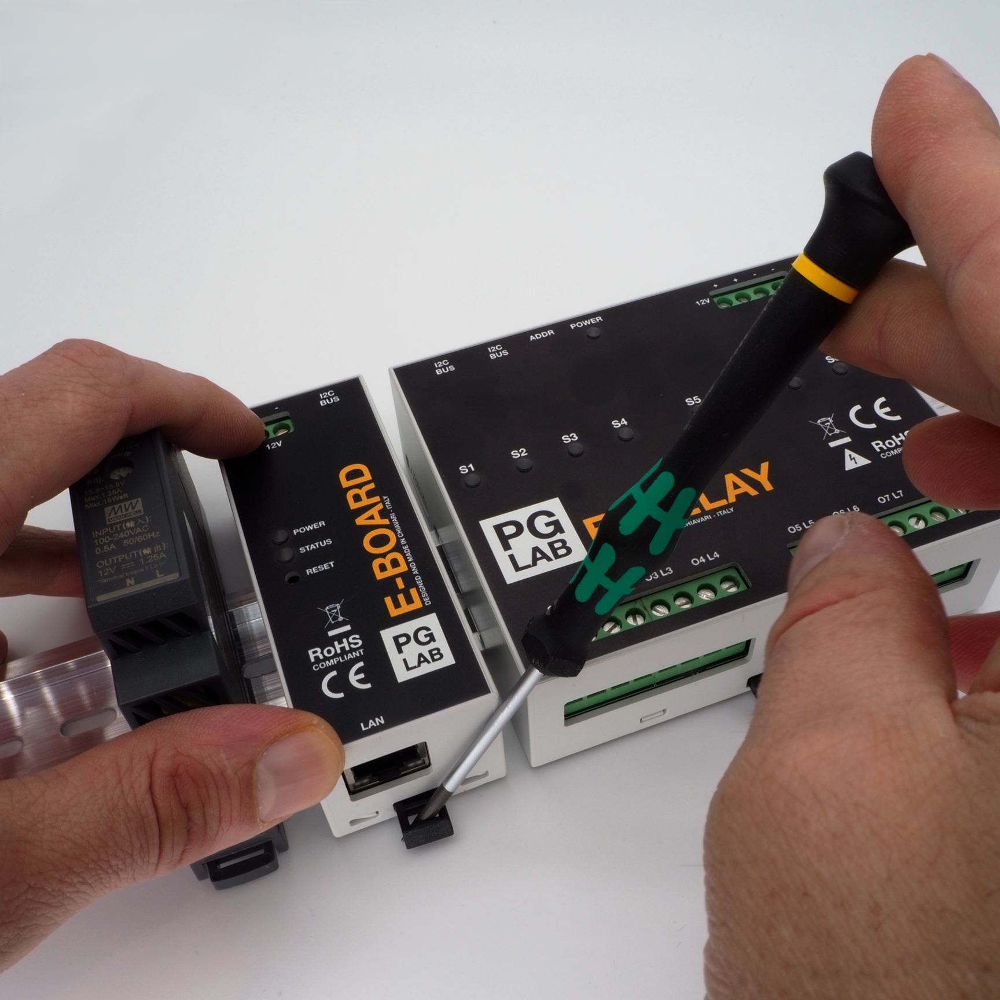

Installation
============

:warning: **Warning** Danger of electrocution. Mounting/installation of E-BOARD/E-RELAY devices to the power grid has to be performed with caution, by a qualified electrician!

:warning: **Warning** Danger of electrocution. Every change in the connections have to be done after ensuring there is no voltage present at E-RELAY terminals!

:warning: **Caution** Use E-BOARD/E-RELAY devices only with appliances which comply with all applicable regulations. A short circuit in any appliance connected to the E-BOARD/E-RELAY may damage the device.

:warning: **Caution** Do not connect E-RELAY to appliances exceeding the given maximum load!

:warning: **Caution** Connect E-BOARD/E-RELAY only in the way shown in these instructions. Any other method could cause damage and/or injury!

:warning: **Caution** Do not use E-BOARD/E-RELAY if it has been damaged!

:warning: **Caution** Do not attempt to service or repair E-BOARD/E-RELAY yourself!

:warning: **Caution** Before mounting E-BOARD/E-RELAY, turn the circuit breakers off, and check that there is no voltage on their terminals. This can be done with a phase tester or multimeter. When you are sure that there is no voltage, you can proceed to mounting and wiring E-BOARD/E-RELAY.

In your package, you will find the E-BOARD and/or E-RELAY device(s).
The devices need to be attached to a standard DIN bar in the switchboard. 
Attach E-BOARD and E-RELAY as shown in the Figure 1.1. Be sure that the ethernet port and
the black hook of the body enclosure is pointing down. You can use a screw driver to
better engage the hook in the DIN bar.

<figcaption>Figure 1.1</figcaption>

Be sure to connect the power lines respecting the polarity as shown in Figure 1.2.
E-RELAY has a double input port to facilitate connecting multiple devices in a daisy chain mode.

<figcaption>Figure 1.2</figcaption>

Connect the I2C port to the E-RELAY I2C port using the supply 4 pin cable as shown in Figure 1.3. E-RELAY has a double 
I2C BUS port to facilitate connecting multiple devices in a daisy chain mode. Use the other I2C port to connect multiple E-RELAY's.

<figcaption>Figure 1.3</figcaption>

!!! warning
    Be sure that there is no voltage on the input power terminal when connecting or disconnecting the I2C cable. E-BOARD does not support hot swapping.

Connect E-BOARD to your local network with a Cat5E cable to your router or switcher as shown in the Figure 1.4.

<figcaption>Figure 1.4</figcaption>
