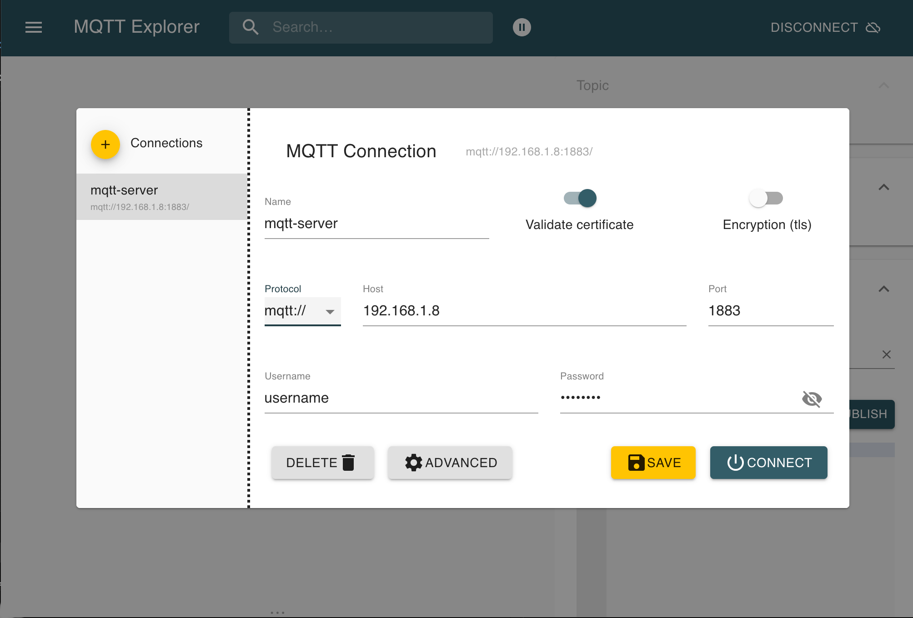
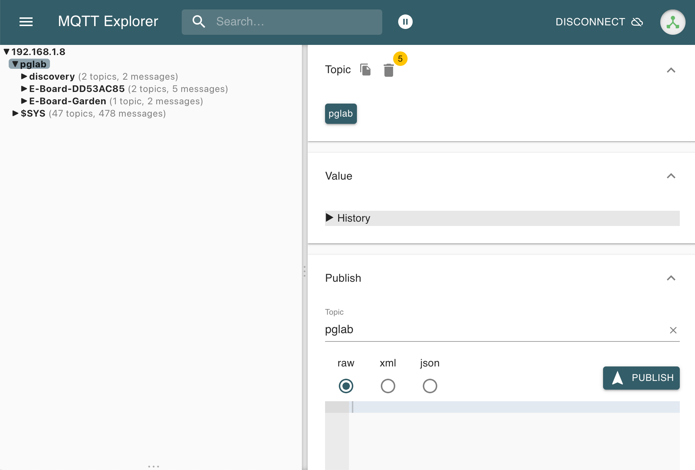
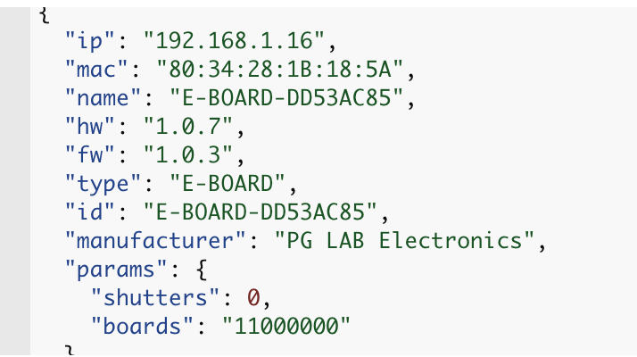

MQTT
====

E-BOARD includes support for MQTT (Message Queue Telemetry Transport). MQTT is an ISO standard (ISO/IEC PRF 20922)
publish-subscribe based “light weight” messaging protocol for use on top of the TCP/IP protocol. It is designed for connections with
remote locations where a “small code footprint” is required or the network bandwidth is limited.

E-BOARD allows control and monitoring over MQTT for both Relay and Shutter output.
You can use any software connected to the same MQTT server to control E-BOARD.

!!! notes
    Go to [Network](webserver-network.md) page to setup E-BOARD MQTT server connection.

!!! notes
    Go to [Setting](webserver-setting.md) page to set the ***MQTT QoS*** (Quality of Service) and the **MQTT retain** message delivery.

To monitor the MQTT server activity we recommend installing the latest version of MQTT-Explorer. Download and install the latest stable release from [mqtt-explorer.com](https://mqtt-explorer.com).
Open MQTT-Explorer client and set all fields to connect to the server as the following picture.

<center>{width="512"  style="border: 1px solid grey;" }</center>

Click CONNECT. When connected find and expand the topic **pglab**, you should see something similar to:

<center>{width="512"  style="border: 1px solid grey;" }</center>

On startup, E-BOARD device connects to MQTT server and immediately publishes a message with the topic **pglab/discovery/E-BOARD-[ID]**. The message is in JSON format,
it can be used to discover all E-BOARD devices connected to the server.
In particular, it contains the following information:

<center>{width="512"  style="border: 1px solid grey;" }</center>

!!! notes
    **id** is the name of the E-BOARD client connected to the MQTT server. It is used to send commands and/or receive updates from E-BOARD.<br>
    **params/shutters** is the number of shutters that E-BOARD controls.<br>
    **params/boards** is a bit mask of all E-RELAY devices connected to E-BOARD. In the picture, "11000000" means that there are two E-RELAY devices connected.

From a terminal window of your HOST computer you can control E-BOARD.
Download and install the latest stable release of mosquitto from [mosquitto.org](https://mosquitto.org/download/).

Relay Control
-------------

Open a terminal window. To turn ON the Relay output 0 run the following command:

``` yaml
$ mosquitto_pub -h 192.168.1.8 -p 1883 -t pglab/E-BOARD-DD53AC85/relay/0/set -m ON
```

To turn ON the Relay output 3 use the following command:

``` yaml
$ mosquitto_pub -h 192.168.1.8 -p 1883 -t pglab/E-BOARD-DD53AC85/relay/3/set -m ON
```
To turn OFF both relay outputs run the following commands:

``` yaml
$ mosquitto_pub -h 192.168.1.8 -p 1883 -t pglab/E-BOARD-DD53AC85/relay/0/set -m OFF
$ mosquitto_pub -h 192.168.1.8 -p 1883 -t pglab/E-BOARD-DD53AC85/relay/3/set -m OFF
```

From the command line you can subscribe to every change of relay outputs. For example, if you are interested in Relay output 0
status updates run the following command:

``` yaml
$ mosquitto_sub -h 192.168.1.8 -p 1883 -t pglab/E-BOARD-DD53AC85/relay/0/state
```
Use E-BOARD [web interface](webserver-relay.md) to toggle the Relay output 0. You should see an output on the terminal window similar to:

``` yaml
ON
OFF
```

Shutter Control
---------------

From the terminal window you can control shutters. To open Shutter 0 use the following command:

``` yaml
$ mosquitto_pub -h 192.168.1.8 -p 1883 -t pglab/E-BOARD-DD53AC85/shutter/0/set -m OPEN
```

To close the Shutter 0 use the following command:
``` yaml
$ mosquitto_pub -h 192.168.1.8 -p 1883 -t pglab/E-BOARD-DD53AC85/shutter/0/set -m CLOSE
```

To stop the Shutter to open or close use the following command:
``` yaml
$ mosquitto_pub -h 192.168.1.8 -p 1883 -t pglab/E-BOARD-DD53AC85/shutter/0/set -m STOP
```

MQTT Topics
-----------

E-BOARD uses the following topics: <br>

| **Topic**                             |  **Value**                | **Description**                       |
| :-------------------------------------| :-------------------------|:--------------------------------------|
| pglab/deviceid/relay/index/set        | ON/OFF                    | turn ON/OFF relay output              |
| pglab/deviceid/shutter/index/set      | OPEN/CLOSE/STOP           | open or close a shutter               |
| pglab/deviceid/relay/index/state      | ON/OFF                    | report relay output status            |
| pglab/deviceid/shutter/index/state    | OPEN/CLOSE/OPENING/CLOSING| report shutter output status          |
| pglab/deviceid/sensor/value           | temp, volt, rtime         | JSON message that reports: CPU temperature, CPU voltage and time in seconds since last reboot. |

!!! notes
    **[deviceid]** is E-BOARD setting {==MQTT ID==}, see [Network](webserver-network.id) page. <br>
    **[index]** can be from 0 to 63 to select a Relay Output or from 0 to 31 to select a Shutter Output.
