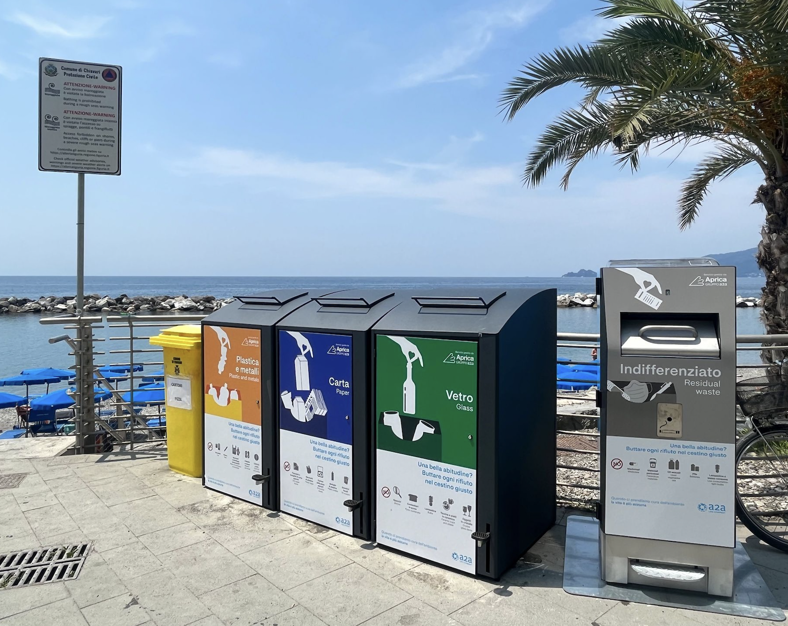
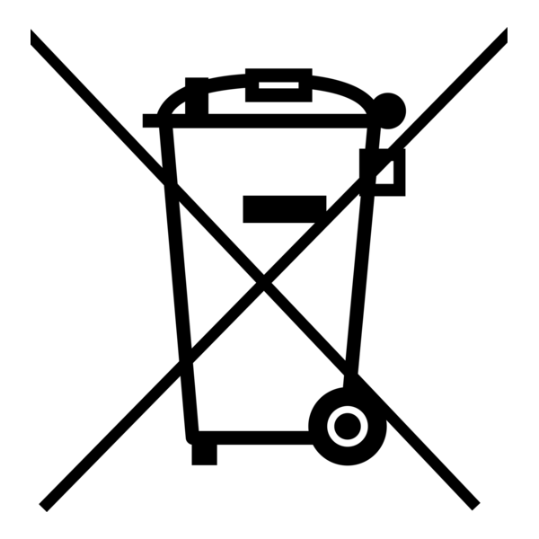

# Recycling Information

{: .center width="512"}

Waste Electrical and Electronic Equipment (WEEE), including packaging materials, must not be discarded together with regular household waste.
Proper disposal helps reduce environmental impact, protects human health, and supports the preservation of natural resources.
Many electrical and electronic devices can be recycled. For details about collection and recycling programs available in your region, please contact your local authority or waste management service.

## Disposal of Electronic Devices

{: .center width="256"}
The symbol shown on the product and/or its packaging indicates that the item falls under the Waste Electrical and Electronic Equipment Directive 2012/19/EU.
Products covered by this directive should not be disposed of with standard household waste.

## Protection of Personal Data

Certain electrical and electronic products may store personal information, depending on the product type. This can include devices connected to Wi-Fi services.
Before disposing of any WEEE product, the user is responsible for removing or deleting all personal data stored on the device.

## Registrations

In compliance with European and national regulations, **PG LAB Electronics S.R.L.S.** is registered with the appropriate organizations and authorities responsible for the implementation of WEEE regulations.

An overview of the registrations is provided below.

| Country | Directive | Registration No. | Authority |
| :--- | :--- | :--- | :--- |
| Netherlands | WEEE | CO10024732 | Stichting Open |
| Germany | WEEE | DE 86143779 | Stiftung ear |
