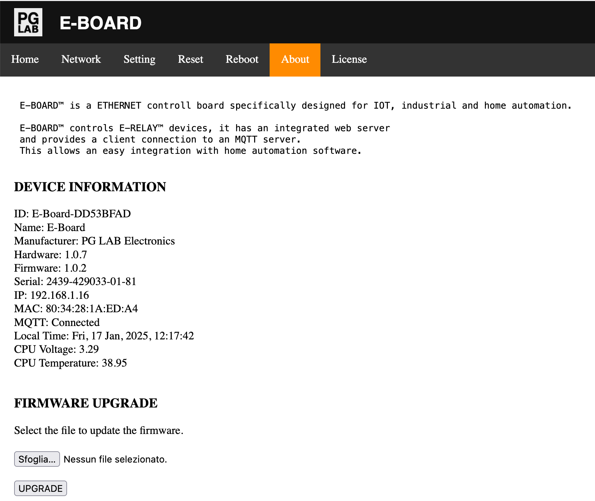

About
======

From the Home page go to the About page. You should see a page similar to the following picture.

{width="512"  style="border: 1px solid grey;" }

In the picture you can see the **DEVICE INFORMATION** as show in this table:

| **Ref.**          |  **Description**                                      |
| :-----------------| :-----------------------------------------------------|
| ID                | The device ID. Every E-BOARD has a unique ID          |
| Name              | The device name: E-BOARD                              |
| Manufacturer      | PG LAB Electronics                                    |
| Hardware          | The hardware version of your E-BOARD device           |
| Firmware          | The version of the current firmware                   |
| Serial            | E-BOARD serial number                                 |
| IP                | E-BOARD IP address on your local network              |
| MAC               | The MAC address of E-BOARD                            |
| MQTT              | The server MQTT connection status                     |
| Local Time        | Local Time according to your time zone                |
| CPU Voltage       | E-BOARD CPU voltage                                   |
| CPU Temperature   | E-BOARD CPU temperature                               |

On the About Page you can also upgrade E-BOARD to the latest available firmware.

Please refer to [Firmware](webserver-firmware.md) for further details.
