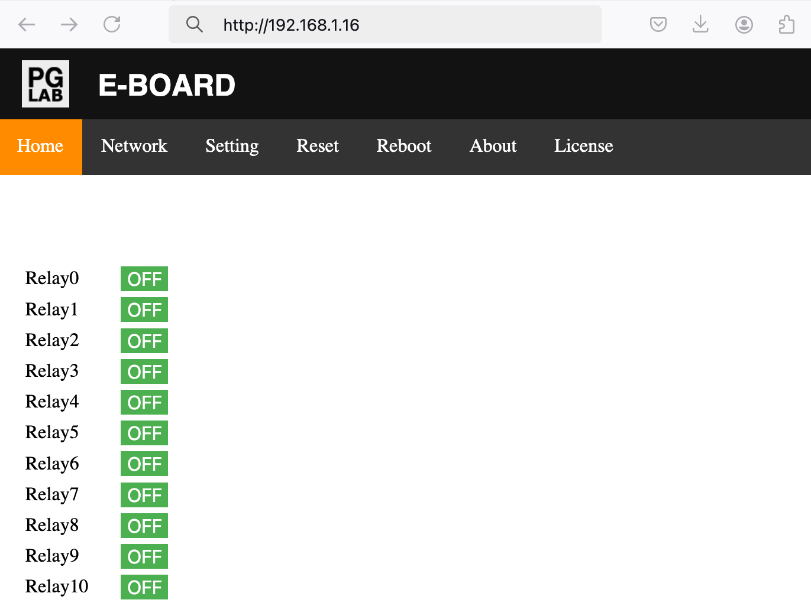

Introduction
============

E-BOARD runs a local HTTP server on port 80. It is a simple web page which allows configuration and a basic use. 

E-BOARD does not have a built-in real time clock but it will automatically synchronize when connected to a SNTP server. Once the time is synchronized the device can schedule internal operation. The default SNTP server is pool.ntp.org, but a custom server can also be configured.

Many configuration settings on E-BOARD are only available over HTTP. 
However, E-BOARD supports MQTT and allows real-time control and status update and integration with external systems.

E-BOARD does not use the Cloud. Full control of E-BOARD is by the local network. 

!!! info
    E-BOARD does not support HTTPS connection.    
    From your web browser it is not possible to connect to E-BOARD using an IP address starting with **"https"** for example: **https**://192.168.1.16.       
    Always connect using an IP address with **"http"** for example: **http**://192.168.1.16

From a host computer, connect to E-BOARD internal web server using the IP number as the web address.
Please see the [Find device IP](find-ip.md) for further details. 

Open your preferred browser and on the address field type the E-BOARD IP number. For example  {==http://192.168.1.16==}

You should be able to see the E-BOARD home page similar to the following picture.

{width="512"  style="border: 1px solid grey;" }

The main page on your browser will show the status of all 64 relays. From the main page you can turn ON
or OFF any specific relay. If the status button is green the relay is available and you can toggle the relay status.
When the status button is a faded green it means that the specific relay is not connected to E-BOARD.