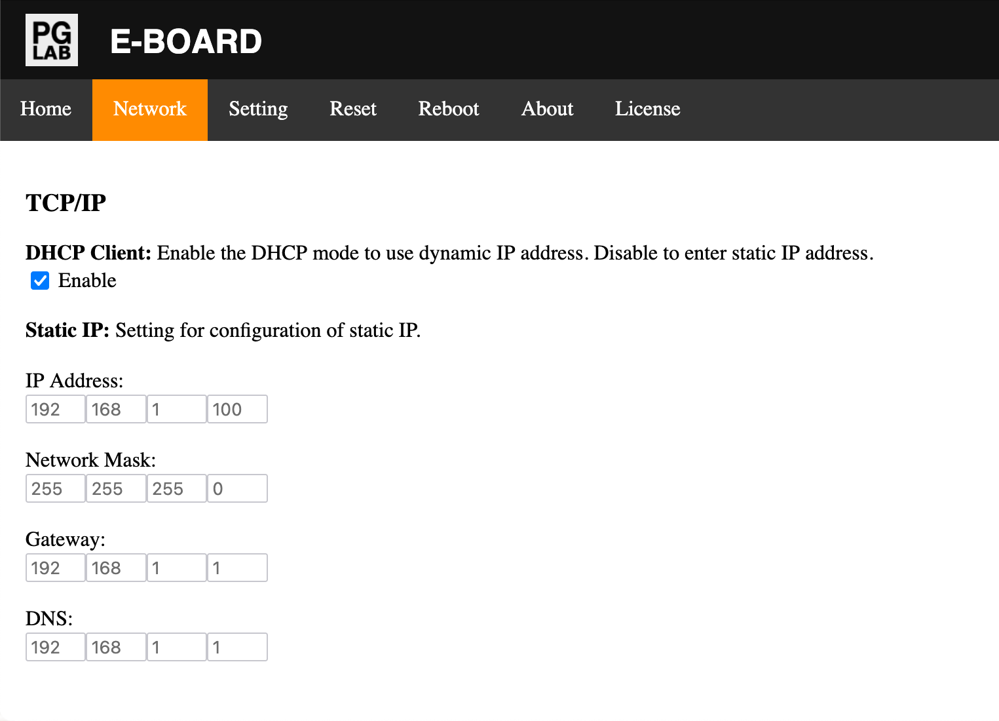

Network
=======

!!! success
    To have an effective change. Click the SAVE button at the end of the **"Setting"** page and reboot E-BOARD from the **"Reboot"** page.

From the Home page go to the Network page. You should see a page similar to the following picture.

{width="512"  style="border: 1px solid grey;" }

The Network page allows you to:

- Setup the IP connection
- Setup the SNTP server
- Setup the MQTT connection

To setup the IP connection you can use DHCP or set a Static IP. The default value is to use DHCP.

The following table shows the available settings:

| **Ref.**          |  **Description**                      |
| :-----------------| :-------------------------------------|
| DHCP Client       | When enable, E-BOARD uses Dynamic IP  |
| IP Address        | Set E-BOARD static IP address         |
| Network Mask      | Set the static network mask           |
| Gateway           | Set the static gateway                |
| DNS               | Set the static DNS                    |

The SNTP server address synchronizes the E-BOARD internal time. Once the time is synchronized the E-BOARD can schedule internal operations. At every hour E-BOARD synchronizes the system time with the SNTP server.

The following table shows the available setting:

| **Ref.**          |  **Description**                              |
| :-----------------| :---------------------------------------------|
| SNTP              | Server address to synchronize the system time |

!!! info
    To verify that the E-BOARD system time has been updated check the Device Information on the [About](webserver-about.md) page.

E-BOARD allows control and status updates over MQTT for both Relay and Shutter outputs.

To setup the client MQTT connection use the following configuration setting:

| **Ref.**      |  **Description**                          |
| :-------------| :-----------------------------------------|
| Server        | Set MQTT server address                   |
| Port          | Set MQTT server port                      |
| Username      | Set Username to connect to MQTT server    |
| Password      | Set Password to connect to MQTT server    |
| MQTT ID       | Set MQTT ID E-BOARD name                  |

!!! important
    It is recommended to use a friendly name in the {==MQTT ID==} setting. For example: E-BOARD-Garden.

!!! info
    The MQTT ID name must be **unique** between all devices with active connections to the MQTT server.

!!! info
    Check the Device Information on the [About](webserver-about.md) page to verify that E-BOARD is connected to the MQTT server.
