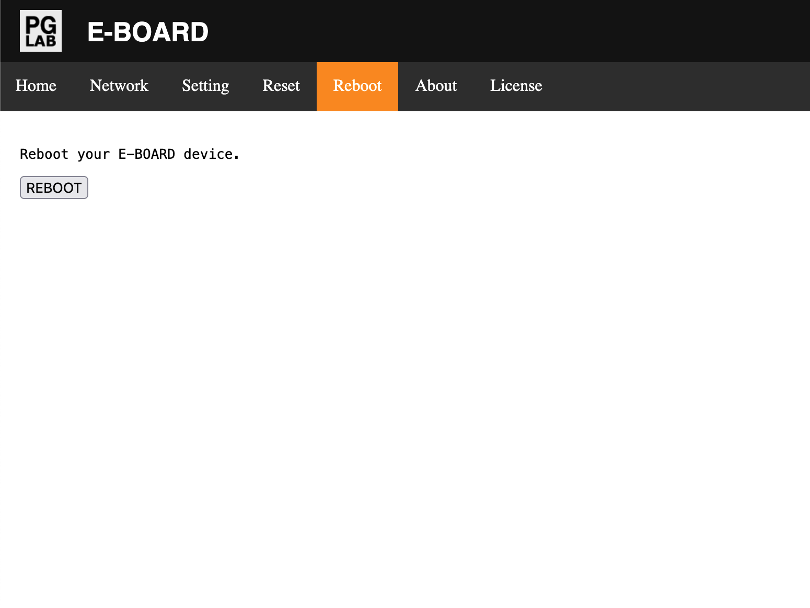

Reboot
======

From the Home page go to the Reboot page. You should see a page similar to the following picture.

{width="512"  style="border: 1px solid grey;" }

The page is used to reboot E-BOARD. When settings have been changed E-BOARD requires a reboot in order to register the new settings.

Clicking on the **REBOOT** button does the following: 

- All relay outputs are turned OFF
- The Green LED on the E-BOARD blinks rapidly a few times
- The device reboots

After a few seconds E-BOARD is ready again.

!!! note
    Always reboot after the settings have been changed by the user.

