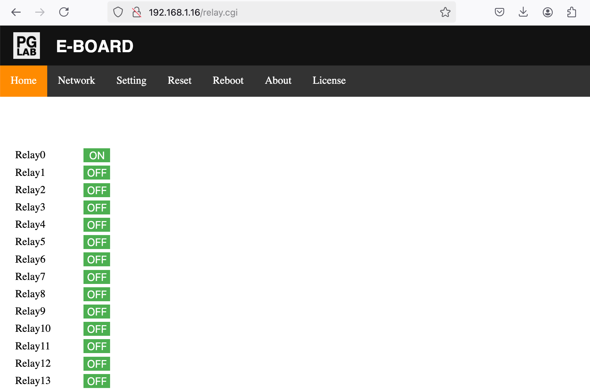
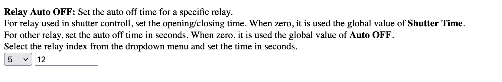

Relay
=====

!!! success
    To have an effective change, click the SAVE button at the end of the **"Setting"** page and reboot E-BOARD from the **"Reboot"** page.

E-BOARD can operate two distinct device types at the same time: 

- Relay  
- Shutter (bi-directional AC motor). 

E-BOARD default configuration is to use Relay only. 

A Relay output is controlled individually and supports the ON and OFF commands.
You can use E-BOARD internal web-server to toggle the Relay status. 

From the Home page click the **"Relay0"** OFF button.  
It should do the following:

- Turn ON the terminal output
- Turn ON the status LED on the E-RELAY 
- The Home page should update as the following picture.

{width="512"  style="border: 1px solid grey;" }

Relay output can also be controlled by MQTT messages. Please see [MQTT](webserver-mqtt.md) for further details.

On the [Setting](webserver-setting.md) page you can find:

- {==Auto_OFF==} setting
- {==Relay_Auto_OFF==} setting
- {==Max_ON==} setting

Relay output supports {==Auto_OFF==} setting. This is a timer in seconds which will turn OFF the output. The user can set a limit for how long the output is ON. The timer can be global or individual for each Relay output.

Relay output supports {==Relay_Auto_OFF==} setting. This is a timer in seconds for all 64 individual Relays. It indicates for how long the Relay output is ON. With this setting the user can configure each individual Relay. 
With a zero value it uses the setting of {==Auto_OFF==} by default.

!!! example
    How to set Relay5 output to 12 seconds ON before to turn OFF.  

    Go to the **"Setting"** page. From the dropdown menu of {==Relay_Auto_OFF==} select the index to 5 and set the value to 12.  
    As shown in the following picture.
    
{ style="border: 1px solid grey;" }

Relay output also supports {==Max_ON==} setting. This is the number of Relay outputs that can be ON at the same time. This setting can be used to prevent power overload of the connected load on the output terminals.

When you power-on E-BOARD all the Relay outputs are initialized OFF.

Please see [Setting](webserver-setting.md) for further details.