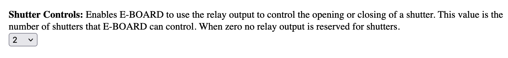
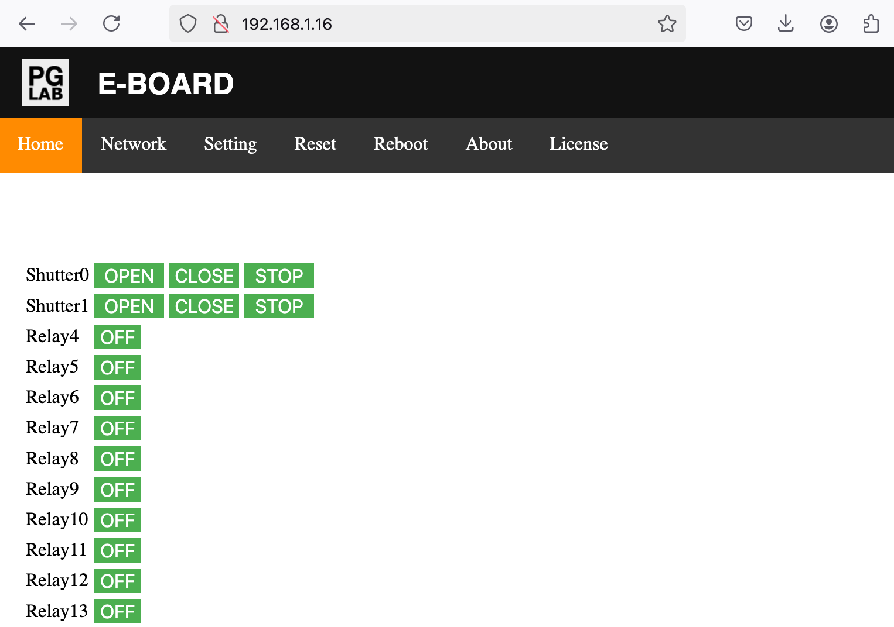
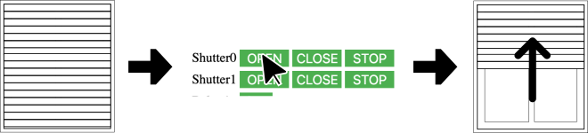
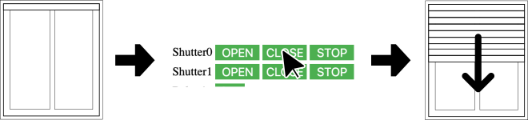
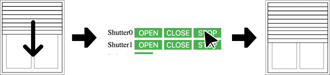

Shutter
=======

!!! success
    To have an effective change. Click the SAVE button at the end of the **"Setting"** page and reboot E-BOARD from the **"Reboot"** page.

E-BOARD can operate two distinct device types at the same time:

- Relay  
- Shutter (bi-directional AC motor)

E-BOARD default configuration is to use Relay only.

To control one or more shutters you have to set {==Shutter_Controls==}.  

From the Home page go to the [Setting](webserver-setting.md) page and change {==Shutter_Controls==} with the number of shutter(s) that you need to control. 

For example:

{ style="border: 1px solid grey;" }

The home page should change as the following picture.

{width="512"  style="border: 1px solid grey;" }

One Shutter output always uses two physical relays. 

For example **Shutter0** uses **Relay0** and **Relay1** terminal output.

- **Relay0** is used to power the AC shutter motor in one direction (opening). 
- **Relay1** is used to power the AC shutter motor in the other direction (closing). 
- E-BOARD guarantees that the two terminal outputs   of a shutter are **never** ON at the same time.

A Shutter output is controlled individually and supports the OPEN, CLOSE, STOP commands.
You can use E-BOARD internal webserver to command a shutter. You can open/close independently any number of shutters.

{width="512" }

From the Home page click the **Shutter0** OPEN button. This turns ON the terminal output to power the shutter motor in one direction, it turns ON the **Relay0** status LED and after the set time the output automatically turns OFF.

{width="512" }

When clicking the **Shutter0** CLOSE button. This turns ON the terminal output to power the shutter motor in the opposite direction, it turns ON the **Relay1** status LED and after the set time the output automatically turns OFF.

{width="512" }

When the shutter is opening or closing, you can always stop the shutter by clicking the STOP button. This turns OFF the terminal outputs of **Relay0** and **Relay1**.

Shutter output can be controlled also by MQTT messages. Please see [MQTT](webserver-mqtt.md) for further details.

On the [Setting](webserver-setting.md) page you can find:

- {==Shutter_Time==} setting
- {==Relay_Auto_OFF==} setting

Shutter output supports {==Shutter_Time==} setting. This is a two value timer in seconds. The opening value is for how long the **opening** Relay terminal is ON. The closing value is for how long the **closing** Relay terminal is ON.

!!! example
    How to set the default shutter **opening** and **closing** time to 20 seconds each.  

    Go to the **"Setting"** page. Set {==Shutter_Time==} **opening** value to 20 and then set the **closing** value to 20.  
    As shown in the following picture.
    
{ style="border: 1px solid grey;" }

Shutter output supports {==Relay_Auto_Off==} setting. This is a timer in seconds for all 64 individual relays. It indicates the time in seconds the Relay output is ON. With this setting the user can set the **opening** and **closing** time for each individual shutter.
With a zero value it uses the setting of {==Shutter_Time==} by default.

!!! example
    How to set **Shutter0** to a 20 second **opening** and 10 second **closing**.

    Go to the **"Setting"** page. From the dropdown menu of {==Relay_Auto_OFF==} select the index 0 and set the value to 20. 
    Then from the dropdown menu of {==Relay_Auto_OFF==} select the index 1 and set the value to 10.  
    As shown in the following table.

    | **Relay index** |  **Value[sec]**      |
    | :---------------| :--------------------|
    | 0               | 20                   |
    | 1               | 10                   |

!!! example
    How to set **Shutter1** to 22 seconds **opening** and 12 seconds **closing**.

    Go to the **"Setting"** page. From the dropdown menu of {==Relay_Auto_OFF==} select the index 2 and set the value to 22. 
    Then from the dropdown menu of {==Relay_Auto_OFF==} select the index 3 and set the value to 12.  
    As shown in the following table.

    | **Relay index** |  **Value[sec]**      |
    | :---------------| :--------------------|
    | 2               | 22                   |
    | 3               | 12                   |

Please see [Setting](webserver-setting.md) for further details.

